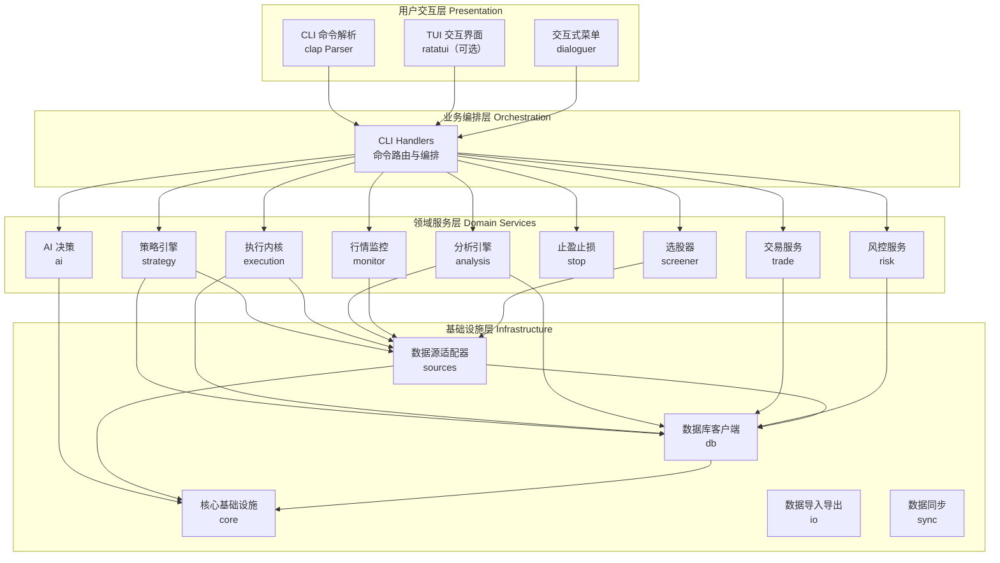
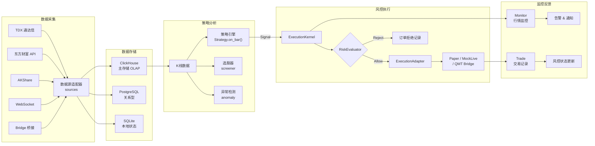
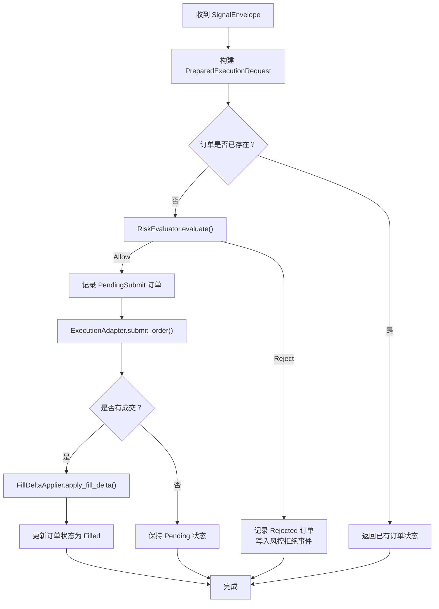
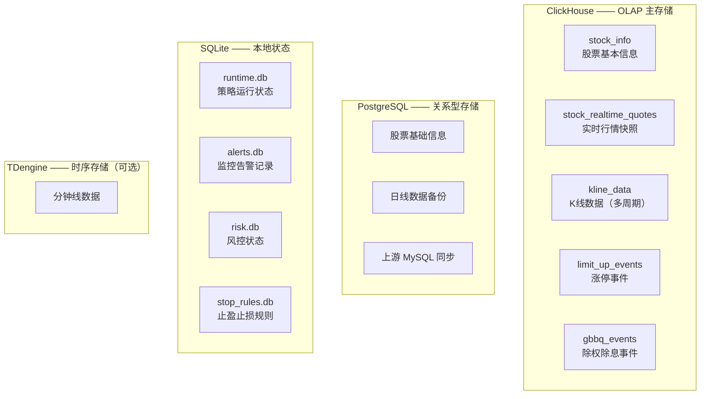

**Quantix-Rust** 是一个用 Rust 编写的 **A股量化交易 CLI 工具**，与同名 Python 项目共享数据源和数据库，提供高性能的量化分析、策略回测、模拟交易和实时监控能力。本文将带你从全局视角理解项目的模块划分、核心数据流和分层架构，帮助你在深入具体模块前建立清晰的认知地图。

Sources: [lib.rs](src/lib.rs#L1-L50), [Cargo.toml](Cargo.toml#L1-L8)

## 一、分层架构总览

项目采用经典的**四层分层架构**，从上到下依次是：用户交互层、业务编排层、领域服务层和基础设施层。每一层只依赖其下方的层，绝不反向引用，确保了模块间的低耦合。

**用户交互层**负责接收用户输入。`quantix` 二进制入口通过 clap 解析命令行参数，支持 20+ 个顶级子命令（如 `data`、`strategy`、`trade`、`risk` 等），也提供交互式菜单和可选的 TUI 界面。

**业务编排层**由 `cli/handlers` 模块承担，每个 handler 函数负责将一条 CLI 命令翻译为对领域服务层的调用序列——创建客户端、加载数据、调用服务、格式化输出。

**领域服务层**包含项目的全部业务逻辑，每个 `src/` 下的顶级子目录对应一个独立领域。这些模块之间通过明确的数据类型和 trait 接口通信。

**基础设施层**提供数据访问和通用能力，包括多数据源适配、多数据库客户端、配置管理、错误处理和交易日历等。

Sources: [main.rs](src/main.rs#L1-L24), [cli/commands/mod.rs](src/cli/commands/mod.rs#L44-L163), [cli/handlers/mod.rs](src/cli/handlers/mod.rs#L109-L244)

## 二、源码目录结构

项目的 `src/` 目录下共有 **22 个顶级模块**，每个模块都是独立的功能域。下表按职责分类列出所有模块及其核心职责：

| 分类 | 模块 | 路径 | 核心职责 |
|------|------|------|----------|
| **核心基础** | `core` | `src/core/` | 配置管理、统一错误类型、异步运行时、交易日历、性能工具 |
| **用户界面** | `cli` | `src/cli/` | 命令定义、命令路由、业务 handler |
| **用户界面** | `tui` | `src/tui/` | 终端 UI 界面（可选 feature） |
| **数据采集** | `sources` | `src/sources/` | TDX/东方财富/AKShare/Bridge/WebSocket 等数据源适配 |
| **数据采集** | `data` | `src/data/` | 核心数据模型（K线、Tick、股票信息、复权类型） |
| **数据采集** | `bridge` | `src/bridge/` | Windows Bridge HTTP 客户端，用于跨平台数据桥接 |
| **数据存储** | `db` | `src/db/` | ClickHouse / PostgreSQL / TDengine 三数据库客户端 |
| **数据存储** | `sync` | `src/sync/` | Python ↔ Rust 数据同步 ETL |
| **数据存储** | `io` | `src/io/` | CSV/JSON/Parquet 导入导出与数据校验 |
| **数据存储** | `import` | `src/import/` | 智能导入（图片识别、CSV、文本解析、代码联想） |
| **分析引擎** | `analysis` | `src/analysis/` | 技术指标、回测引擎、竞价分析、K线形态、Polars 批量计算 |
| **分析引擎** | `anomaly` | `src/anomaly/` | Isolation Forest 异常检测 |
| **分析引擎** | `screener` | `src/screener/` | 选股器：预设条件筛选、规则匹配 |
| **策略引擎** | `strategy` | `src/strategy/` | Strategy trait 定义、5 种内置策略、策略 Daemon、配置管理 |
| **执行引擎** | `execution` | `src/execution/` | ExecutionKernel、Paper/MockLive/QMT 适配器、订单生命周期 |
| **风控体系** | `risk` | `src/risk/` | 风控规则、持仓评估、波动率计算、行业集中度、实盘镜像导入 |
| **风控体系** | `stop` | `src/stop/` | 止盈止损规则管理、实时评估 |
| **交易服务** | `trade` | `src/trade/` | 模拟交易账户、持仓管理、费用计算、交易报告 |
| **交易服务** | `account` | `src/account/` | 多账户管理、账户组、智能订单路由 |
| **信息聚合** | `ai` | `src/ai/` | LLM 多模型适配（OpenAI/DeepSeek 等）、决策引擎 |
| **信息聚合** | `news` | `src/news/` | 多源新闻搜索与聚合（Tavily/SerpAPI/博查等） |
| **信息聚合** | `fundamental` | `src/fundamental/` | 基本面数据：估值、财报、龙虎榜、机构持仓 |
| **信息聚合** | `market` | `src/market/` | 市场总览、板块排名、龙头筛选、北向资金、舆情分析 |
| **运维监控** | `monitor` | `src/monitor/` | 行情监控服务、价格告警、Daemon 运行模式、systemd 服务 |
| **运维监控** | `monitoring` | `src/monitoring/` | 信号/持仓/性能三维度监控、Prometheus 指标、多渠道通知 |
| **自选管理** | `watchlist` | `src/watchlist/` | 自选股列表 CRUD、分组标签、行情快照解析 |
| **任务调度** | `tasks` | `src/tasks/` | Cron 调度器、定时任务模板、数据采集调度 |

Sources: [lib.rs](src/lib.rs#L17-L43)

## 三、核心数据流

理解 Quantix-Rust 的关键是掌握**信号从数据到执行**的完整生命周期。下面这张图展示了一条交易信号从数据采集到最终执行的完整路径：

这条数据流的核心设计原则是**单一方向流动**：数据从外部源采集 → 存入数据库 → 被策略消费产生信号 → 信号经过风控审核 → 通过执行适配器下单 → 交易结果回写并触发监控告警。没有任何环节会反向依赖上游模块。

Sources: [sources/mod.rs](src/sources/mod.rs#L1-L30), [execution/kernel/mod.rs](src/execution/kernel/mod.rs#L28-L61), [strategy/trait_def.rs](src/strategy/trait_def.rs#L10-L29)

## 四、关键 Trait 抽象体系

项目通过 Rust 的 trait 机制定义了一组核心抽象，使得各模块可以**面向接口编程**，方便替换具体实现。这是理解整个架构灵活性的关键。

### 4.1 Strategy Trait —— 策略统一接口

所有交易策略必须实现 `Strategy` trait，它定义了策略的三个生命周期阶段：`init`（初始化）→ `on_bar`（逐根K线处理）→ `finish`（收尾）。当前内置了 5 种策略：

| 策略 | 配置类型 | 核心逻辑 |
|------|----------|----------|
| `MACrossStrategy` | 无需额外配置 | 均线交叉策略 |
| `BreakoutStrategy` | `BreakoutConfig` | 突破策略 |
| `MomentumStrategy` | `MomentumConfig` | 动量策略 |
| `MeanReversionStrategy` | `MeanReversionConfig` | 均值回归策略 |
| `GridStrategy` | `GridConfig` | 网格交易策略 |

每条K线数据流入 `on_bar()` 后，策略输出 `Signal::Buy`、`Signal::Sell` 或 `Signal::Hold` 信号，交由下游执行内核处理。

Sources: [strategy/trait_def.rs](src/strategy/trait_def.rs#L10-L38), [strategy/mod.rs](src/strategy/mod.rs#L1-L45)

### 4.2 ExecutionAdapter Trait —— 执行适配器

`ExecutionAdapter` trait 定义了订单的三个操作：`submit_order`（提交）、`query_order`（查询）、`cancel_order`（撤销）。项目提供了三种实现：

| 适配器 | 用途 | 场景 |
|--------|------|------|
| `PaperExecutionAdapter` | 纸上交易 | 模拟环境，即时成交 |
| `MockLiveExecutionAdapter` | 模拟实盘 | 模拟延迟和部分成交 |
| `QmtBridgePreviewAdapter` | QMT 预览 | 通过 Windows Bridge 预览券商委托 |

Sources: [execution/adapter.rs](src/execution/adapter.rs#L48-L63)

### 4.3 RiskEvaluator 与 FillDeltaApplier

`RiskEvaluator` trait 是风控的拦截点——`ExecutionKernel` 在提交订单前调用 `evaluate()` 获取 `RiskDecision::Allow` 或 `RiskDecision::Reject`。`FillDeltaApplier` 则在成交后应用持仓变动。这两个 trait 让风控逻辑完全可插拔。

Sources: [execution/kernel/traits.rs](src/execution/kernel/traits.rs#L1-L19)

## 五、ExecutionKernel —— 执行生命周期核心

**ExecutionKernel** 是整个交易执行的中央调度器，它采用泛型参数 `<A, F, R>` 分别代表执行适配器、成交变动器和风控评估器。其核心工作流程如下：

Kernel 的关键设计在于：所有状态变更都通过 `StrategyRuntimeStore`（基于 SQLite）持久化，包括订单记录、订单事件日志和策略运行记录。即使进程崩溃重启，也能通过 `recovery` 模块恢复未完成的订单。

Sources: [execution/kernel/mod.rs](src/execution/kernel/mod.rs#L28-L143)

## 六、数据存储架构

项目采用**多数据库协同**策略，根据数据特性选择最优存储引擎：

| 数据库 | 角色定位 | 访问方式 | 配置来源 |
|--------|----------|----------|----------|
| **ClickHouse** | 海量行情数据的主存储，MergeTree 引擎 + 月度分区 | HTTP REST API | 环境变量 `CLICKHOUSE_*` |
| **PostgreSQL** | 关系型业务数据，上游 MySQL 桥接源 | sqlx 异步连接池 | 环境变量 `QUANTIX_UPSTREAM_MYSQL_*` |
| **SQLite** | 本地状态持久化（订单、告警、风控） | rusqlite 嵌入式 | `~/.quantix/` 下的文件路径 |
| **TDengine** | 可选的时序数据库 | REST API | `config/default.toml` |

`CliRuntime` 是运行时的配置中心，它在启动时从环境变量和 `.env` 文件加载所有数据库连接信息、文件路径和 Bridge 配置，以单一结构体传递给各 handler 使用。

Sources: [db/mod.rs](src/db/mod.rs#L1-L15), [core/runtime.rs](src/core/runtime.rs#L69-L109), [core/config.rs](src/core/config.rs#L1-L97)

## 七、数据源适配器矩阵

项目支持 **6 种数据源**，通过统一的适配器模式对外提供一致的接口：

| 数据源 | 实现文件 | 数据类型 | 特点 |
|--------|----------|----------|------|
| **TDX 通达信** | `sources/tdx.rs` | 实时行情、历史K线 | 基于 `rustdx-complete` crate，支持多主机 |
| **东方财富** | `sources/eastmoney.rs` | 股票列表、实时行情、资金流向、财务数据 | HTTP API，支持板块分类筛选 |
| **AKShare** | `sources/akshare.rs` | 财务数据、历史数据 | HTTP API，有速率限制 |
| **Bridge TDX** | `sources/bridge_tdx.rs` | 通过 Windows Bridge 获取 TDX 数据 | 跨平台桥接，用于 WSL 环境 |
| **WebSocket** | `sources/websocket.rs` | 实时行情订阅 | 自动重连、心跳保活、连接状态管理 |
| **TDX 文件** | `sources/tdx_file.rs` | 日线文件、股本变迁文件 | 本地文件解析，支持前/后复权计算 |

此外，`sources/kline_aggregator.rs` 将实时 Tick 数据聚合为多周期K线，`sources/auction_collector.rs` 专门采集竞价阶段数据，`sources/quote_collector.rs` 负责批量股票行情采集。

Sources: [sources/mod.rs](src/sources/mod.rs#L1-L30)

## 八、配置与环境管理

项目的配置管理采用**多层叠加**策略，优先级从低到高为：

1. **`config/default.toml`** —— 默认配置，包含数据库连接、数据源、交易时段、通知渠道等基础设置
2. **环境变量** —— 通过 `config` crate 的 `Environment` source 覆盖，使用 `__` 分隔符（如 `DATABASE__POSTGRESQL__HOST`）
3. **`.env` 文件** —— 在启动时通过 `dotenv` 自动加载，存放敏感信息（密码、API Key）
4. **Feature flags** —— 编译时选择数据库后端（`postgresql`、`sqlite`、`tdengine-rest`、`tui`）

核心的环境变量分组如下：

| 分组 | 关键变量 | 用途 |
|------|----------|------|
| ClickHouse | `CLICKHOUSE_URL/DB/USER/PASSWORD` | 主数据库连接 |
| 上游 MySQL | `QUANTIX_UPSTREAM_MYSQL_*` | 与 Python 端数据同步 |
| Bridge | `QUANTIX_BRIDGE_BASE_URL/API_KEY` | Windows Bridge 桥接服务 |
| 存储路径 | `QUANTIX_WATCHLIST_PATH/TRADE_PATH/RISK_PATH/...` | 各模块的本地存储位置 |
| 策略配置 | `QUANTIX_STRATEGY_CONFIG_PATH/STRATEGY_RUNTIME_DB_PATH` | 策略配置和运行时数据库 |

Sources: [config/default.toml](config/default.toml#L1-L87), [core/runtime.rs](src/core/runtime.rs#L1-L121), [Cargo.toml](Cargo.toml#L102-L108)

## 九、统一错误处理

项目定义了 `QuantixError` 枚举作为全局错误类型，通过 `thiserror` 派生 `Error` trait，并为常见的第三方错误（`std::io::Error`、`serde_json::Error`、`sqlx::Error`、`reqwest::Error`）提供 `From` 自动转换。所有业务函数返回 `Result<T>`（即 `std::result::Result<T, QuantixError>`），确保错误在整个调用链中统一传播。

| 错误变体 | 触发场景 |
|----------|----------|
| `Config(String)` | 配置文件解析失败、缺少必要配置项 |
| `DatabaseConnection/Query` | 数据库连接或查询失败 |
| `DataSource/DataParse` | 数据源返回异常或数据格式不符 |
| `Timeout/Network` | 网络请求超时或连接失败 |
| `Algo(String)` | 算法交易执行器内部错误 |

Sources: [core/error.rs](src/core/error.rs#L1-L58)

## 十、CLI 命令体系概览

`quantix` 二进制支持以下顶级子命令，每个子命令下还有多级嵌套子命令：

| 命令 | 功能说明 | 对应领域模块 |
|------|----------|-------------|
| `init` | 初始化配置和数据库 | `core` |
| `menu` / `status` | 交互式菜单、系统状态检查 | `cli` |
| `data` | 数据采集、查询、导入导出 | `sources` + `db` + `io` |
| `strategy` | 策略创建/运行/列表/信号/Daemon | `strategy` |
| `task` | 定时任务管理 | `tasks` |
| `analyze` | 技术指标计算、K线形态分析 | `analysis` |
| `backtest` | 策略回测 | `analysis::backtest` |
| `performance` | 绩效报告 | `analysis::performance` |
| `monitor` | 行情监控、告警、Daemon | `monitor` |
| `stop` | 止盈止损规则管理 | `stop` |
| `watchlist` | 自选股管理 | `watchlist` |
| `market` | 市场总览、板块排名 | `market` |
| `trade` | 模拟交易、持仓管理 | `trade` |
| `risk` | 风控规则、持仓评估、实盘导入 | `risk` |
| `execution` | 执行请求管理、Daemon | `execution` |
| `anomaly` | 异常检测 | `anomaly` |
| `algo` | 算法交易（TWAP/VWAP） | `execution::algo` |
| `account` | 多账户管理、订单路由 | `account` |
| `notify` | 通知测试 | `monitoring::notification` |
| `ai` | AI 决策分析 | `ai` |
| `news` | 新闻搜索 | `news` |
| `fundamental` | 基本面数据查询 | `fundamental` |
| `sentiment` | 舆情分析 | `market::sentiment` |
| `import` | 智能导入（图片/CSV/文本） | `import` |

Sources: [cli/commands/mod.rs](src/cli/commands/mod.rs#L44-L163)

## 十一、从架构到深入：推荐阅读路径

理解了项目架构全景之后，建议按照以下顺序深入各子系统。每一步都建立在前一步的知识基础上：

1. **[配置管理与多环境加载机制](5-pei-zhi-guan-li-yu-duo-huan-jing-jia-zai-ji-zhi)** —— 理解 `CliRuntime` 如何从环境变量和配置文件加载全部运行参数
2. **[统一错误处理与异步运行时](6-tong-cuo-wu-chu-li-yu-yi-bu-yun-xing-shi)** —— 掌握 `QuantixError` 错误传播和 tokio 异步运行时的使用模式
3. **[多数据源适配器架构](8-duo-shu-ju-yuan-gua-pei-qi-jia-gou-tdx-akshare-dong-fang-cai-fu-bridge)** —— 深入 6 种数据源的适配器实现细节
4. **[多数据库集成](9-duo-shu-ju-ku-ji-cheng-clickhouse-postgresql-tdengine)** —— 了解 ClickHouse/PostgreSQL/SQLite 三库的分工与协同
5. **[策略 Trait 抽象与内置策略实现](11-ce-lue-trait-chou-xiang-yu-nei-zhi-ce-lue-shi-xian)** —— 学习 `Strategy` trait 的设计思路和 5 种内置策略
6. **[ExecutionKernel 执行生命周期](12-executionkernel-zhi-xing-sheng-ming-zhou-qi-yu-feng-kong-ping-gu)** —— 掌握从信号到订单的完整执行管线和风控拦截机制

如果你更关注运维部署，可以直接跳转到 [Docker 容器化部署与生产环境配置](26-docker-rong-qi-hua-bu-shu-yu-sheng-chan-huan-jing-pei-zhi) 和 [监控告警体系](24-jian-kong-gao-jing-ti-xi-yu-prometheus-zhi-biao-dao-chu)。