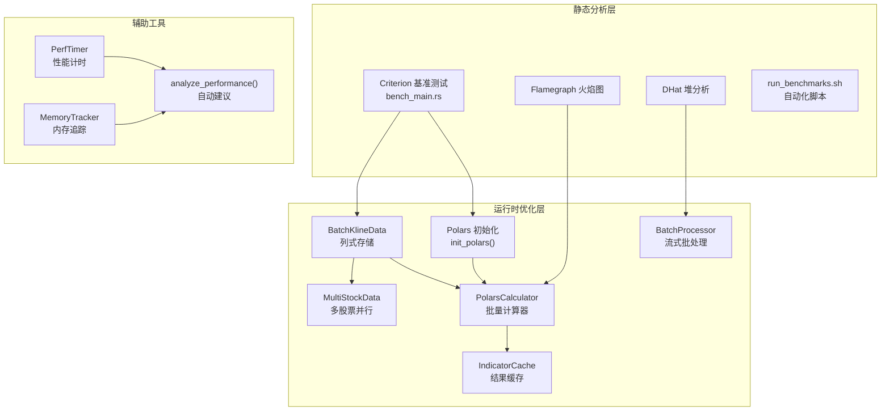
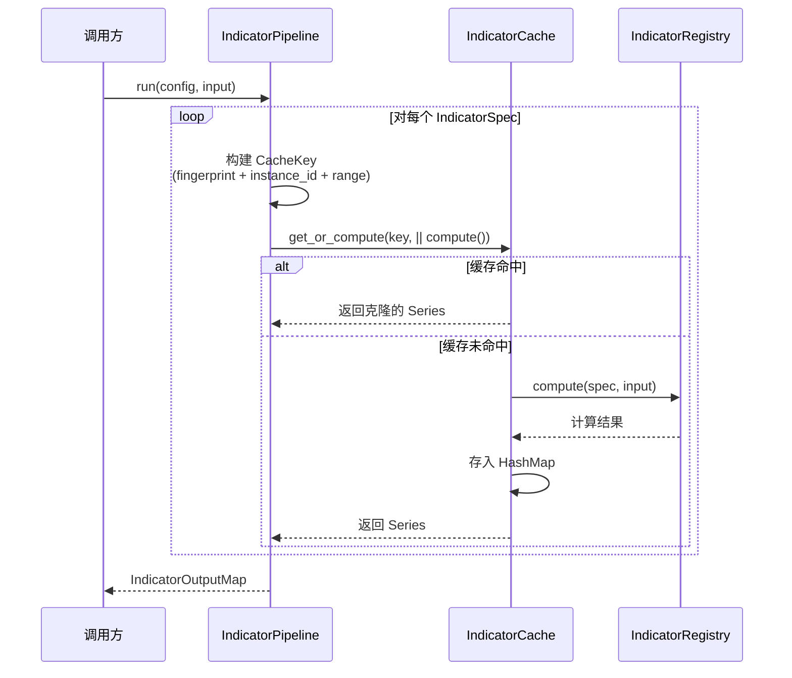

本页深入剖析 Quantix-Rust 项目中**性能优化的两大支柱**——基于 Polars DataFrame 的列式批量计算引擎，以及基于 Criterion 的统计严谨基准测试体系。文档面向高级开发者，从架构设计原则出发，逐层拆解数据流、算法复杂度、内存策略和运行时调优的工程实践，帮助你在新增指标、扩展数据源或重构管线时做出有数据支撑的性能决策。

Sources: [Cargo.toml](Cargo.toml#L69-L71), [Cargo.toml](Cargo.toml#L110-L128)

---

## 架构全景：双层性能基础设施

Quantix-Rust 的性能基础设施分为**静态分析层**（基准测试与剖析）和**运行时优化层**（批量计算与缓存）。两层协同工作：基准测试提供量化基线，运行时优化在此基线上持续迭代。



**核心设计原则**：所有数据处理都走列式路径（`Vec<f64>` → Polars Series），而非逐条遍历 `Vec<Kline>` 结构体。这一选择消除了结构体字段的指针跳转开销，使 CPU 缓存行命中率最大化。

Sources: [src/analysis/polars_adapter.rs](src/analysis/polars_adapter.rs#L1-L44), [src/analysis/mod.rs](src/analysis/mod.rs#L32-L34)

---

## Polars 批量计算引擎

### BatchKlineData：列式 K 线容器

**`BatchKlineData`** 是整个批量计算管线的数据入口，将传统的行式 K 线数据转换为列式存储。每个字段（`open`、`high`、`low`、`close`、`volume`、`amount`）都是独立的连续内存 `Vec`，而非交错存储在结构体中。

| 字段 | 类型 | 说明 |
|------|------|------|
| `code` | `String` | 股票代码 |
| `timestamps` | `Vec<i64>` | Unix 时间戳序列 |
| `open/high/low/close` | `Vec<f64>` | OHLC 价格列 |
| `volume` | `Vec<i64>` | 成交量列 |
| `amount` | `Vec<f64>` | 成交额列 |

列式布局的关键优势在于**空间局部性**：计算 SMA 时只需遍历 `close` 列，CPU 预取器能高效填充缓存行，避免了行式布局中每条记录跳过无关字段的开销。从 `Vec<Kline>` 转换时，`from_kline_vec()` 函数使用 `Vec::with_capacity(klines.len())` 预分配每列容量，消除增长过程中的重复分配。

Sources: [src/analysis/polars_adapter.rs](src/analysis/polars_adapter.rs#L26-L82), [src/analysis/polars_adapter.rs](src/analysis/polars_adapter.rs#L408-L459)

### Polars 全局初始化

**`init_polars()`** 在应用启动时调用，通过环境变量 `POLARS_MAX_THREADS` 将 Polars 线程池大小设置为 CPU 逻辑核心数。这一步确保后续所有 Polars 操作（尤其是 `rolling_mean` 等窗口函数）能充分利用多核并行：

```rust
pub fn init_polars() -> Result<()> {
    let num_threads = std::thread::available_parallelism()
        .map_err(|e| QuantixError::Other(format!("获取 CPU 核心数失败: {}", e)))?;
    unsafe { std::env::set_var("POLARS_MAX_THREADS", num_threads.to_string()) };
    tracing::info!("Polars 初始化完成，使用 {} 线程", num_threads);
    Ok(())
}
```

**注意**：此函数使用 `unsafe` 修改环境变量，必须在任何 Polars 操作之前调用，且不能在多线程启动后调用（否则存在数据竞争风险）。

Sources: [src/analysis/polars_adapter.rs](src/analysis/polars_adapter.rs#L15-L23)

### PolarsCalculator：单股票批量指标计算

**`PolarsCalculator`** 是无状态的计算器（零大小 `_private: ()` 字段），每次调用独立计算，天然支持并发。它提供了两条计算路径：

**路径 1：Polars 原生路径（SMA/MA）**

MA 计算直接使用 Polars 的 `rolling_mean`，底层是经过 SIMD 优化的 C 实现：

```rust
let opts = RollingOptionsFixedWindow {
    window_size: period,
    min_periods: period,
    center: false,
    ..Default::default()
};
close_series.rolling_mean(opts)
```

**路径 2：Rust 原生路径（EMA/RSI/KDJ/MACD）**

这些指标需要自定义递推逻辑（EMA 的指数衰减、RSI 的涨跌平滑），Polars 无内置支持，因此回退到 [indicators.rs](src/analysis/indicators.rs) 的纯 Rust 实现。转换过程中需要 `close_as_decimal()` 将 `Vec<f64>` 转为 `Vec<Decimal>`，这是一个性能开销点（后续优化建议见下文）。

**`calculate_batch()` 方法**是批量优化的核心：接收指标名称列表（如 `["ma5", "ma10", "ma20"]`），一次性构建 DataFrame，然后通过字符串前缀解析出所有 MA 周期，循环调用 `rolling_mean`。对于非 MA 指标（如 `rsi14`），则逐个调用对应方法：

Sources: [src/analysis/polars_adapter.rs](src/analysis/polars_adapter.rs#L84-L324)

### MultiStockData：多股票并行批量计算

**`MultiStockData`** 在 `HashMap<String, BatchKlineData>` 上封装了多股票批量计算入口 `calculate_batch_indicators()`。当前实现遍历 `HashMap` 的每个 key，调用 `PolarsCalculator::calculate_batch()` 处理单只股票。该方法内部会尝试构建合并 DataFrame（按 `code` + `timestamp` 列堆叠），为未来的 Polars `group_by` 并行计算预留了架构空间。

Sources: [src/analysis/polars_adapter.rs](src/analysis/polars_adapter.rs#L333-L399)

---

## 纯 Rust 指标算法复杂度分析

当 Polars 无法直接计算时，回退到 [indicators.rs](src/analysis/indicators.rs) 和 [momentum.rs](src/analysis/indicators/momentum.rs) 的纯 Rust 实现。以下是对关键指标算法复杂度的精确分析：

| 指标 | 时间复杂度 | 空间复杂度 | 核心技巧 |
|------|-----------|-----------|---------|
| **SMA** | O(n) | O(n) | 滑动窗口：`sum = sum + data[i] - data[i-period]` |
| **EMA** | O(n) | O(n) | 递推：`ema_val = data[i] * α + ema_val * (1 - α)` |
| **WMA** | O(n × period) | O(n) | 每窗口加权求和（无优化版） |
| **RSI** | O(n) | O(n) | Wilder 平滑：`avg_gain = (prev_avg × (period-1) + gain) / period` |
| **MACD** | O(n) | O(n) | 三次 EMA（fast/slow/signal）线性组合 |
| **KDJ** | O(n × period) | O(n) | 每窗口扫描 high/low 极值 |
| **BOLL** | O(n × period) | O(n) | 每窗口均值 + 方差，Newton 平方根近似 |
| **ATR** | O(n) | O(n) | TR 递推 + EMA 平滑 |
| **OBV** | O(n) | O(n) | 累加量，O(1) 递推 |

**SMA 的 O(n) 滑动窗口**是性能最优化的典范：初始窗口求和后，每次迭代只需一次加法和一次减法，避免了每窗口重新求和的 O(n × period) 开销。RSI 的 Wilder 平滑同样将每步计算限制在 O(1) 操作。

**BOLL 的 `sqrt_approx()`** 使用 Newton-Raphson 迭代法，最多 20 次迭代、精度 1/1,000,000，是 `Decimal` 类型下不依赖 `libm` 的实用方案。

Sources: [src/analysis/indicators.rs](src/analysis/indicators.rs#L14-L72), [src/analysis/indicators.rs](src/analysis/indicators.rs#L118-L159), [src/analysis/indicators.rs](src/analysis/indicators.rs#L331-L349), [src/analysis/indicators/momentum.rs](src/analysis/indicators/momentum.rs#L1-L181)

---

## 指标管线缓存机制

**`IndicatorPipeline`** 将 `IndicatorRegistry`（指标注册与计算）和 `IndicatorCache`（结果缓存）组合为完整管线。缓存的核心是 `get_or_compute()` 模式：



**缓存键（`IndicatorCacheKey`）** 由三个维度组成：`dataset_fingerprint`（数据集指纹，基于 close 价格序列的归一化字符串）、`instance_id`（指标名 + 参数的规范 JSON）、`range`（起止索引）。任何维度变化都会触发重新计算。

**性能影响**：当同一管线中对相同数据多次请求相同指标时（如多个策略都依赖 SMA(20)），第二次及后续调用直接从 HashMap 读取，避免重复计算。缓存的代价是 `IndicatorSeries::clone()`，对于万级数据量约在微秒级别。

Sources: [src/analysis/pipeline.rs](src/analysis/pipeline.rs#L1-L77), [src/analysis/indicator_cache.rs](src/analysis/indicator_cache.rs#L1-L61)

---

## Criterion 基准测试体系

### 测试架构与配置

基准测试定义在 [benches/bench_main.rs](benches/bench_main.rs)，通过 Criterion 0.5 框架驱动。`Cargo.toml` 中配置了 `[[bench]] name = "bench_main" harness = false`，告诉 Rust 编译器使用自定义测试 harness 而非 libtest。

**Criterion 配置参数**（来自 `benchmark_config()` 函数）：

| 参数 | 值 | 含义 |
|------|-----|------|
| `warm_up_time` | 3 秒 | 预热阶段让 CPU 频率稳定、分支预测生效 |
| `measurement_time` | 10 秒 | 采样阶段收集执行时间 |
| `significance_level` | 0.05 | 95% 置信度判断性能变化是否显著 |
| `noise_threshold` | 0.02 | 2% 噪声阈值，低于此变化视为噪声 |
| `sample_size` | 100 | 每个 benchmark 采 100 个数据点 |

Sources: [benches/bench_main.rs](benches/bench_main.rs#L247-L268), [Cargo.toml](Cargo.toml#L120-L123)

### 五组基准测试详解

**Group 1: `indicators`——技术指标计算**

在 `[100, 1000, 10000]` 三种数据规模下测试 SMA(5)、SMA(20)、EMA(12)、EMA(26)、RSI(14)、MACD(12,26,9)。使用 `black_box()` 防止编译器消除死代码。测试函数来自 [indicators_benches.rs](src/analysis/indicators_benches.rs)，这是专为基准测试优化的独立实现（不依赖 `Option<Decimal>` 包装，直接返回 `Vec<Decimal>`）。

**Group 2: `export`——数据导出**

在 `[1000, 10000, 100000]` 规模下测试 CSV 和 JSON 导出。每次迭代创建临时目录，使用 `tokio::runtime::Runtime::new().block_on()` 同步等待异步导出完成。`sample_size(10)` 因为 IO 操作方差大、耗时久。

**Group 3: `validation`——数据验证**

测试 `validate_klines` 和 `quality_report` 两个方法，数据规模 `[100, 1000, 10000]`。这组测试揭示验证逻辑是否引入不必要的开销。

**Group 4: `performance`——回测性能指标**

测试 `calculate_total_return`、`calculate_max_drawdown`、`calculate_sharpe_ratio`，数据规模 `[100, 500, 1000]`。权益曲线通过保守收益率（±1%）生成，避免 `rust_decimal` 乘法溢出。

**Group 5: `batch`——批处理吞吐量**

测试 `BatchProcessor::process_in_batches()`，数据规模 `[10000, 100000, 1000000]`。这组测试直接衡量批处理框架的分块开销。

Sources: [benches/bench_main.rs](benches/bench_main.rs#L1-L269)

### Phase 18 实测基线数据

以下数据来自 Phase 18 的完整基准测试运行（2026-03-08），是当前性能优化的参照基线：

**技术指标计算（indicators 组）**

| 操作 | 100 条 | 1,000 条 | 10,000 条 |
|------|--------|----------|-----------|
| SMA(5) | 7.93 µs | 111.49 µs | 1.54 ms |
| EMA(12) | 22.65 µs | 229.48 µs | 2.37 ms |
| RSI(14) | 38.87 µs | 463.78 µs | 4.98 ms |
| MACD | 54.51 µs | 535.31 µs | 5.57 ms |

**数据导出（export 组）**

| 格式 | 1,000 条 | 10,000 条 | 100,000 条 |
|------|----------|-----------|------------|
| CSV | 2.02 ms | 11.46 ms | 147.28 ms |
| JSON | 3.90 ms | 34.84 ms | 168.66 ms |

**批处理（batch 组）**

| 数据量 | 平均时间 | 吞吐量 |
|--------|---------|--------|
| 10,000 | 426.84 µs | ~23.4M 记录/秒 |
| 100,000 | 5.92 ms | ~16.9M 记录/秒 |
| 1,000,000 | 102.00 ms | ~9.80M 记录/秒 |

**关键发现**：JSON 导出比 CSV 慢 2-3 倍；MACD 在 10K 规模下约 5.6ms（需三次 EMA 递推）；批处理在百万级数据下仍保持近千万记录/秒的吞吐。

Sources: [docs/reports/PHASE18_BENCHMARK_RESULTS.md](docs/reports/PHASE18_BENCHMARK_RESULTS.md#L1-L177)

### 运行基准测试

项目提供了自动化脚本 `scripts/dev/run_benchmarks.sh`，支持以下模式：

```bash
# 运行全部基准测试
./scripts/dev/run_benchmarks.sh

# 保存当前结果为基线（用于后续对比）
./scripts/dev/run_benchmarks.sh --baseline

# 与已保存的基线对比（检测性能回归）
./scripts/dev/run_benchmarks.sh --compare

# 生成火焰图（需要安装 flamegraph）
./scripts/dev/run_benchmarks.sh --flamegraph

# 堆分配分析
./scripts/dev/run_benchmarks.sh --dhat
```

也可以直接使用 `cargo bench`：

```bash
cargo bench --all-features                  # 运行全部
cargo bench --bench bench_main indicators   # 只跑 indicators 组
cargo bench -- --save-baseline v0.2         # 保存基线
cargo bench -- --baseline v0.2              # 对比基线
```

Sources: [scripts/dev/run_benchmarks.sh](scripts/dev/run_benchmarks.sh#L1-L250)

---

## 批处理框架与内存策略

### BatchProcessor 三种处理模式

**`BatchProcessor`**（定义在 [src/io/batch.rs](src/io/batch.rs)）提供三种数据处理模式，每种适用于不同场景：

**模式 1：`batch_export()`——分批导出**

将大数组按 `batch_size`（默认 1000）分块，每块调用用户提供的 `export_fn` 写入独立文件（`{prefix}_batch_{N}.csv`）。使用 `indicatif` 进度条实时显示处理进度。适用场景：大数据集分文件导出。

**模式 2：`batch_import()`——并发导入**

使用 `tokio::spawn` + `Semaphore`（默认最大并发 4）并行导入多个数据源。信号量控制并发度，防止内存和连接池耗尽。适用场景：多文件/多数据源并行加载。

**模式 3：`stream_process()`——流式处理**

按批次拉取数据，每 10 批调用 `tokio::task::yield_now()` 释放执行时间片，避免长时间占用事件循环。适用场景：超大文件/流式数据源。

### BatchConfig 配置参数

| 参数 | 默认值 | 说明 |
|------|--------|------|
| `batch_size` | 1000 | 每批处理记录数 |
| `max_concurrent_tasks` | 4 | 并发导入最大任务数 |
| `enable_progress` | true | 是否显示进度条 |
| `memory_limit_mb` | 512 | 内存限制（MB），预留用于未来背压机制 |

### BatchProgress 实时统计

`BatchProgress` 在批处理过程中持续追踪 `processed_records`、`success_count`、`error_count`，并实时计算吞吐量（`records_per_second()`）和预估剩余时间（`estimated_remaining_secs()`），为运维提供可视化反馈。

Sources: [src/io/batch.rs](src/io/batch.rs#L1-L322), [src/io/mod.rs](src/io/mod.rs#L1-L19)

---

## 性能诊断工具集

### PerfTimer：耗时监测

**`PerfTimer`** 使用 `std::time::Instant` 计时，`Drop` trait 自动检查：若操作超过 100ms，在 stderr 输出 `⚠️ Slow` 警告。这使得耗时异常的操作无需手动埋点即可被发现。使用方式：

```rust
let _timer = PerfTimer::new("calculate_all_indicators");
// ... 执行操作
// _timer 离开作用域时自动打印耗时（若 > 100ms）
```

Sources: [src/core/performance_utils.rs](src/core/performance_utils.rs#L8-L43)

### MemoryTracker：内存增量追踪

**`MemoryTracker`** 在 Linux 上通过读取 `/proc/self/status` 的 `VmRSS` 字段获取当前进程 RSS（Resident Set Size），计算操作前后的内存增量（KB）。`delta_kb()` 返回 `isize`，正值为分配、负值为释放。适用场景：验证预分配策略是否有效、检测内存泄漏。

Sources: [src/core/performance_utils.rs](src/core/performance_utils.rs#L46-L101)

### analyze_performance()：自动优化建议

**`analyze_performance()`** 函数接收操作名称、数据量、耗时（ms）和内存增量（KB），基于三个阈值生成 `OptimizationSuggestion` 枚举：

| 触发条件 | 建议类型 |
|----------|---------|
| 吞吐量 < 1000 items/s 且数据量 > 1000 | `IncreaseBatchSize` |
| 内存增量 > 10 MB | `UsePreallocation` |
| 耗时 > 100ms 且数据量 > 10000 | `EnableParallelProcessing` |

Sources: [src/core/performance_utils.rs](src/core/performance_utils.rs#L103-L185)

---

## Release Profile 编译优化

`Cargo.toml` 中的 `[profile.release]` 配置了最大化运行时性能的编译选项：

| 参数 | 值 | 效果 |
|------|-----|------|
| `opt-level` | 3 | 最高优化级别，启用循环展开、内联、向量化 |
| `lto` | true | 跨 crate 链接时优化，消除泛型单态化的冗余代码 |
| `codegen-units` | 1 | 单编译单元，允许更全局的优化（牺牲编译速度） |
| `strip` | true | 剥离调试符号，减小二进制体积 |

**代价**：编译时间显著增长（尤其 LTO），但换来 10-30% 的运行时性能提升。对于量化交易系统，这是正确的权衡。

Sources: [Cargo.toml](Cargo.toml#L124-L129)

---

## 性能优化实战策略

### 策略 1：Decimal → f64 的精度权衡

当前 `PolarsCalculator` 在计算 RSI/KDJ/MACD 时需要将 `Vec<f64>` 转为 `Vec<Decimal>`（`close_as_decimal()`），计算完再转回来。这个转换链（`f64 → String → Decimal`）是显著的开销点。

**优化方向**：对于非资金计算场景（纯指标计算），可以设计一套 `f64` 原生指标函数，避免 Decimal 转换。基准测试显示 SMA(5) 在 10K 数据上耗时 1.54ms，其中相当比例来自 Decimal 运算。SMA 的滑动窗口用 `f64` 实现（如 Polars 的 `rolling_mean`）已在 `PolarsCalculator::ma()` 中证明可行。

### 策略 2：WMA 和 BOLL 的 O(n × period) 优化

WMA 当前每窗口重新求加权和，BOLL 每窗口重新求方差。对于大 `period`（如 60、120），可以引入：
- **WMA**：利用差分公式将加权和递推化
- **BOLL**：维护滚动 `sum` 和滚动 `sum_sq`，O(1) 递推方差

### 策略 3：Polars LazyFrame 管线化

当前 `calculate_batch()` 使用 Eager 模式（直接操作 Series）。对于多指标组合计算，可以切换到 `LazyFrame`，让 Polars 查询优化器自动合并相同窗口计算、消除中间分配：

```rust
// 伪代码示意
let lf = df.lazy()
    .with_column(col("close").rolling_mean(RollingOptions { window_size: 5 }).alias("ma5"))
    .with_column(col("close").rolling_mean(RollingOptions { window_size: 20 }).alias("ma20"))
    .collect()?;
```

### 策略 4：并发指标计算

`MultiStockData::calculate_batch_indicators()` 当前是串行遍历 `HashMap`。可以使用 `rayon::par_iter()` 将多股票计算并行化：

```rust
self.stocks.par_iter().map(|(code, data)| {
    let calc = PolarsCalculator::new();
    (code.clone(), calc.calculate_batch(data, indicators))
}).collect()
```

`PolarsCalculator` 是无状态的，`rayon` 的线程安全天然适配。由于每只股票的指标计算是独立的，理论上在 8 核机器上可获得接近 8 倍加速。

### 策略 5：`from_kline_vec()` 的零拷贝优化

当前 `from_kline_vec()` 遍历 `Vec<Kline>` 并将每个 `Decimal` 字段转为 `f64`，产生 N 次分配。如果上游数据源（如 TDX 文件解析）能直接产出 `Vec<f64>` 列而非 `Vec<Kline>`，可以消除这一转换层。

Sources: [src/analysis/polars_adapter.rs](src/analysis/polars_adapter.rs#L58-L63), [src/analysis/indicators.rs](src/analysis/indicators.rs#L74-L100), [src/analysis/polars_adapter.rs](src/analysis/polars_adapter.rs#L353-L385)

---

## 依赖版本与特性矩阵

性能相关依赖及其在项目中的角色：

| 依赖 | 版本 | 特性 | 角色 |
|------|------|------|------|
| `polars` | 0.43 | `lazy`, `rolling_window`, `dtype-datetime` | 列式批量计算 |
| `polars-ops` | 0.43 | — | Polars 底层算子 |
| `criterion` | 0.5 | — (dev) | 统计基准测试 |
| `rayon` | 1.10 | — | CPU 并行迭代器 |
| `arrow` | 53 | `json` | 零拷贝列式内存 |
| `parquet` | 53 | `async` | 列式存储格式 |
| `ndarray` | 0.15 | 可选 | N 维数组（未启用） |
| `indicatif` | 0.17 | — | 进度条 |

Polars 0.43 是一个重要的版本锚点——API 从旧版的 `Series::rolling_mean(String, usize)` 迁移为 `RollingOptionsFixedWindow` 参数结构体，字符串列名使用 `PlSmallStr` 替代 `&str`。

Sources: [Cargo.toml](Cargo.toml#L66-L71), [Cargo.toml](Cargo.toml#L112-L113)

---

## 基准测试编写规范

### 新增基准测试的模板

```rust
fn bench_your_feature(c: &mut Criterion) {
    let mut group = c.benchmark_group("your_module");
    
    // 多规模测试，覆盖真实场景
    for size in [100, 1000, 10000].iter() {
        let data = prepare_fixture(*size);
        
        group.bench_with_input(
            BenchmarkId::new("operation_name", size),
            &data,
            |b, data| b.iter(|| your_function(black_box(data))),
        );
    }
    
    group.finish();
}
```

### 关键规则

1. **使用 `black_box()`** 包裹输入和输出，防止 LLVM 优化掉计算
2. **多规模梯度** 至少覆盖小/中/大三档，暴露算法复杂度问题
3. **IO 测试降 `sample_size`**（如 `group.sample_size(10)`），避免采样阶段过长
4. **避免在闭包内创建 `Runtime`**——基准测试内的 `tokio::runtime::Runtime::new()` 应在 `bench_with_input` 外部创建，或使用 `lazy_static!` 复用
5. **基准测试函数放在 `indicators_benches.rs`**，与生产代码的 `indicators.rs` 分离，避免 `Option<Decimal>` 包装引入噪声

Sources: [benches/bench_main.rs](benches/bench_main.rs#L49-L87), [src/analysis/indicators_benches.rs](src/analysis/indicators_benches.rs#L1-L105)

---

## 延伸阅读

- **技术指标管线架构** → [技术指标管线与注册表机制](15-ji-zhu-zhi-biao-guan-xian-yu-zhu-ce-biao-ji-zhi)
- **回测性能指标计算** → [事件驱动回测引擎与性能指标计算](16-shi-jian-qu-dong-hui-ce-yin-qing-yu-xing-neng-zhi-biao-ji-suan)
- **Prometheus 实时性能监控** → [监控告警体系与 Prometheus 指标导出](24-jian-kong-gao-jing-ti-xi-yu-prometheus-zhi-biao-dao-chu)
- **Rust 编码规范中的性能模式** → [Rust 编码规范（文件拆分、模块组织、类型安全）](28-rust-bian-ma-gui-fan-wen-jian-chai-fen-mo-kuai-zu-zhi-lei-xing-an-quan)