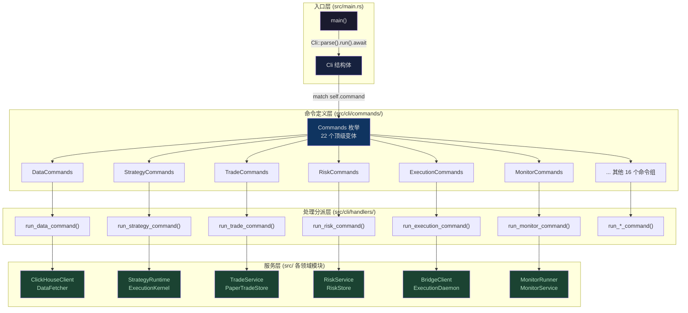
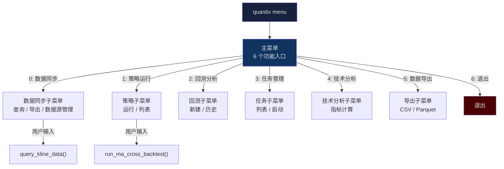
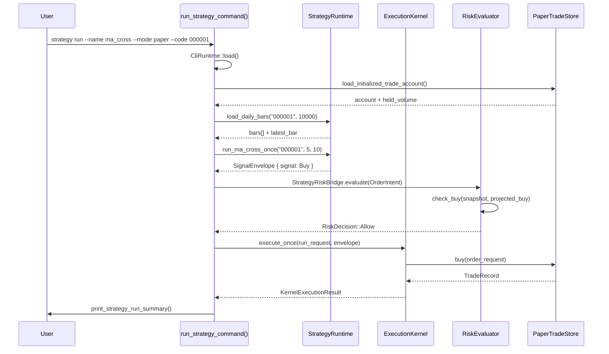

Quantix CLI 是整个量化交易系统的**用户交互入口**，基于 Rust clap 4.5 的 derive 模式构建了一套**三层分派架构**：命令定义层（Commands）声明参数与子命令结构，处理层（Handlers）完成业务分派与输出格式化，服务层（Services）封装核心领域逻辑。整个 CLI 拥有 22 个顶级命令组，包含 50+ 个枚举定义的子命令类型，覆盖从数据采集到实盘交易的全链路操作。本文档将系统性地解析这套命令体系的组织结构、分派机制与交互流程，帮助开发者在理解整体架构后快速定位和扩展具体的命令实现。

Sources: [main.rs](src/main.rs#L1-L24), [mod.rs](src/cli/mod.rs#L1-L25)

## 命令架构总览

Quantix CLI 的命令体系遵循经典的 **职责分层** 原则。入口函数 `main.rs` 仅负责日志初始化与命令解析，通过 `Cli::parse().run().await` 一行代码将控制权移交给命令层。`Cli` 结构体内部持有一个 `Commands` 枚举作为顶级子命令分派器，每个枚举变体对应一个功能域。这种设计使得命令定义与业务逻辑完全解耦——新增命令只需在枚举中添加变体并在 `run()` 的 `match` 分支中接入处理函数，无需修改框架代码。



命令定义层由 11 个文件组成，按功能域拆分：`data.rs`、`strategy.rs`、`trade.rs`、`risk.rs`、`monitor.rs`、`analysis.rs`、`backtest.rs`、`performance.rs`、`market.rs`、`account.rs`、`info.rs`。每个文件导出一个或多个 `#[derive(Subcommand)]` 枚举，共同在 `commands/mod.rs` 的 `Commands` 枚举中汇聚为顶级子命令。处理分派层则由 45 个 handler 文件组成（约 16,700 行代码），每个 handler 函数对应一个命令分派入口，内部完成 `CliRuntime` 加载、存储实例化和业务函数调用。

Sources: [commands/mod.rs](src/cli/commands/mod.rs#L44-L163), [main.rs](src/main.rs#L1-L24)

## 顶级命令地图

下面的表格列出了所有 22 个顶级命令及其功能域和子命令数量，帮助开发者快速定位感兴趣的命令入口：

| 命令 | 说明 | 子命令深度 | 核心子命令示例 |
|---|---|---|---|
| `init` | 初始化配置和数据库 | 0 | `--config-path` |
| `menu` | 交互式菜单 | 0 | `--tui` |
| `status` | 系统状态与健康检查 | 0 | `--health` |
| `data` | 数据查询/导出/数据源管理 | 2 | `source list`, `query`, `export` |
| `strategy` | 策略实例 CRUD + 运行 + 守护进程 | 3 | `create`, `run`, `daemon run`, `signal approve` |
| `task` | 定时任务模板与调度器 | 0 | `list`, `start`, `stop`, `status` |
| `analyze` | 技术指标/K线形态/选股筛选 | 2 | `indicators`, `candle-pattern`, `screener run` |
| `backtest` | 回测运行与报告管理 | 0 | `run`, `report`, `list`, `compare` |
| `performance` | 回测绩效详情与对比 | 0 | `report`, `list`, `compare` |
| `monitor` | 自选池监控 + 告警 + 守护进程 | 2 | `watchlist`, `alert add`, `daemon run`, `service install` |
| `stop` | 止盈止损规则管理 | 0 | `set`, `update`, `list`, `status`, `history`, `remove` |
| `watchlist` | 自选池股票/分组/标签管理 | 2 | `add`, `remove`, `list`, `group create`, `tag add` |
| `market` | 行业/概念/北向/情绪/龙头 | 0 | `sector`, `concept`, `north`, `sentiment`, `leader`, `overview` |
| `trade` | 模拟交易买卖 + 持仓/费用查看 | 0 | `init`, `buy`, `sell`, `history`, `overview`, `position` |
| `risk` | 风控规则/流水导入/镜像账户 | 2 | `rule set`, `log`, `status`, `import live-trades` |
| `execution` | 执行守护进程 + Bridge/QMT | 3 | `config init`, `daemon run`, `bridge qmt-live`, `qmt live` |
| `anomaly` | Isolation Forest 异常检测 | 0 | `run` |
| `algo` | TWAP/VWAP 算法交易 | 0 | `create`, `start`, `pause`, `plan`, `list` |
| `account` | 多账户注册/账户组/路由 | 2 | `register`, `list`, `group create`, `split` |
| `notify` | 多渠道通知测试/发送 | 0 | `test`, `send`, `list`, `check` |
| `ai` | AI 股票分析/交易决策/问答 | 0 | `analyze`, `decide`, `ask`, `market`, `config` |
| `news` | 多源新闻搜索/趋势分析 | 0 | `search`, `code`, `trend`, `providers` |
| `fundamental` | 估值/财报/龙虎榜/机构持仓 | 0 | `show`, `valuation`, `earnings`, `institution`, `dragon-tiger` |
| `sentiment` | 舆情数据/历史趋势/提及 | 0 | `show`, `history`, `mentions` |
| `import` | 图片/CSV/剪贴板/文本智能导入 | 0 | `from-image`, `from-csv`, `from-clipboard`, `from-text`, `resolve` |

Sources: [commands/mod.rs](src/cli/commands/mod.rs#L53-L163)

## 三层分派机制

### 第一层：Clap 参数解析

CLI 使用 `clap::Parser` derive 宏自动生成命令行参数解析器。`Cli` 结构体通过 `#[command(subcommand)]` 标注的 `command` 字段，将控制权委托给 `Commands` 枚举。每个枚举变体对应一个顶级命令，变体内部可通过 `#[command(subcommand)]` 继续嵌套子命令枚举，形成**最大 3 层的命令树**。参数声明使用 `#[arg]` 属性标注短名、长名、默认值和互斥约束等元信息。

例如 `StrategyCommands::Create` 的参数定义展示了典型的 clap 参数模式：

```rust
Create {
    #[arg(long)]
    id: String,                // 必选参数，--id
    #[arg(short, long)]
    name: String,              // 短名 -n 或长名 --name
    #[arg(long = "param")]
    params: Vec<String>,       // 可重复参数，--param key=value
    #[arg(long)]
    disabled: bool,            // 布尔标志
},
```

Sources: [commands/strategy.rs](src/cli/commands/strategy.rs#L6-L26), [commands/mod.rs](src/cli/commands/mod.rs#L44-L51)

### 第二层：Handler 分派

`Commands` 枚举的 `run()` 方法是一个大型 `match` 表达式，每个分支调用对应模块的处理函数。处理函数按命名约定组织：`run_data_command`、`run_strategy_command`、`run_trade_command` 等。每个处理函数内部再次 `match` 子命令枚举，逐层分派到具体的业务实现。以 `run_strategy_command` 为例，它处理了 `Create`/`Update`/`Delete`/`Run`/`List`/`Show` 六种直接操作，以及 `Config`/`Daemon`/`Signal`/`Request`/`Service`/`ServiceConfig` 六组嵌套子命令。

Handler 层的职责明确：**仅负责参数解构、运行时初始化和结果输出**。它不包含核心业务逻辑——业务逻辑被委托到各领域服务模块中。例如 `execute_strategy_daemon_run` 函数内部只做三件事：(1) 加载 `CliRuntime` 配置，(2) 初始化存储和加载器，(3) 调用 `StrategySignalDaemon::run_once()` 执行策略计算。

Sources: [handlers/mod.rs](src/cli/handlers/mod.rs#L251-L394), [commands/mod.rs](src/cli/commands/mod.rs#L165-L250)

### 第三层：服务调用

Handler 通过 `CliRuntime::load()` 获取全局配置（数据库连接字符串、文件路径等），然后创建各领域服务的实例。典型的服务实例化模式如下：

```rust
let runtime = CliRuntime::load();                          // 加载配置
let runtime_store = StrategyRuntimeStore::new(             // 创建运行时存储
    runtime.strategy_runtime_db_path
).await?;
let trade_store = JsonPaperTradeStore::new(runtime.trade_path); // 创建交易存储
let risk_store = JsonRiskStore::new(runtime.risk_path);         // 创建风控存储
```

这种模式在整个处理层中反复出现，每个 handler 函数都遵循相同的"加载配置 → 创建存储 → 调用服务 → 输出结果"流程。

Sources: [handlers/mod.rs](src/cli/handlers/mod.rs#L591-L598), [handlers/strategy_handler.rs](src/cli/handlers/strategy_handler.rs#L223-L251)

## 交互式菜单系统

除了命令行直接调用外，Quantix CLI 提供了两种交互模式：`quantix menu` 启动的**简单菜单**和 `quantix menu --tui` 规划中的 TUI 界面。

### 简单菜单

简单菜单基于 `dialoguer` 库的 `Select` 组件实现，提供 6 个功能入口：数据同步、策略运行、回测分析、任务管理、技术分析和数据导出。每个入口对应一个子菜单，子菜单内部使用 `dialoguer::Input` 获取用户输入后调用对应的 handler 函数。菜单系统是一个 `loop` 循环，用户选择"退出"后 `break` 跳出。



### 初始化向导

`quantix init` 命令是一个**环境诊断与初始化向导**，按 7 个步骤执行：(1) 检查/创建配置目录，(2) 加载运行时配置，(3) 创建数据目录（Watchlist、Trade、Risk、Monitor DB、Strategy 等），(4) 检查已有数据文件，(5) 初始化 Polars 计算引擎，(6) 环境变量检查，(7) 数据库连通性探测（ClickHouse、MySQL、Bridge 的 TCP 异步探测，超时 3 秒）。每个步骤都有带 emoji 的状态输出，方便用户快速定位问题。

Sources: [handlers/app_shell.rs](src/cli/handlers/app_shell.rs#L3-L150), [handlers/app_shell.rs](src/cli/handlers/app_shell.rs#L183-L218)

## 核心命令流程详解

### 策略运行流程（strategy run）

策略运行是系统中最复杂的命令流程之一，它串联了策略计算、风控评估和执行引擎三个核心子系统。当用户执行 `quantix strategy run --name ma_cross --mode paper --code 000001` 时，系统按以下流程执行：



这个流程的关键设计在于 **RiskEvaluator** 和 **FillDeltaApplier** 两个桥接 trait——它们将 handler 层与底层执行引擎解耦，使得 `paper` 模式和 `mock_live` 模式可以使用不同的适配器（`PaperExecutionAdapter` vs `MockLiveExecutionAdapter`）但共享相同的风控逻辑。

Sources: [handlers/mod.rs](src/cli/handlers/mod.rs#L251-L280), [handlers/strategy_handler.rs](src/cli/handlers/strategy_handler.rs#L17-L141)

### 信号审批与执行请求流程（strategy signal → execution）

策略守护进程运行后生成的信号需要经过**审批（approve/reject）→ 执行请求（request）→ 执行（execute/daemon）** 三阶段流程，这是实盘交易的核心安全机制：

1. **信号生成**：`strategy daemon run` 调用 `StrategySignalDaemon::run_once()` 遍历所有启用的策略实例，对每只股票计算信号并持久化到 SQLite 运行时存储
2. **信号审批**：`strategy signal approve --signal-id X --target-mode paper --target-account default` 将信号状态从 `pending` 变为 `approved`，同时创建一条 `ExecutionRequestRecord`
3. **执行请求消费**：`execution daemon run` 从运行时存储中消费 `Pending` 状态的执行请求，通过 `ExecutionKernel` 调用对应模式的执行适配器完成下单

对于 QMT 实盘模式，流程增加了安全确认步骤：`execution bridge qmt-live --request-id X` 在提交真实订单前会显示订单详情并要求用户输入 `YES` 确认。

Sources: [handlers/strategy_handler/requests.rs](src/cli/handlers/strategy_handler/requests.rs#L63-L104), [handlers/execution_handler.rs](src/cli/handlers/execution_handler.rs#L101-L176)

### 数据源管理流程（data source）

数据源管理命令支持运行时动态配置 TDX 和 AkShare 两种数据源，配置持久化到 `data_sources.toml` 文件。关键命令包括 `source list`（列出已配置数据源）、`source add --type tdx --hosts 192.168.1.1,192.168.1.2`（新增数据源）、`source set-default --name tdx`（设置默认数据源）和 `source test --name tdx`（测试连通性）。`DataSourceKind` 枚举通过 `ValueEnum` derive 限制用户只能选择 `tdx` 或 `akshare` 两种类型。

Sources: [commands/data.rs](src/cli/commands/data.rs#L48-L124)

## 命令组织模式与设计惯例

### ArgGroup 互斥约束

对于需要互斥参数的命令，CLI 使用 clap 的 `ArgGroup` 机制声明约束。例如 `monitor watchlist` 要求 `--once` 和 `--repeat` 二选一；`stop set` 要求 `--loss`/`--loss-pct`/`--trailing` 至少指定一种止损方式；`analyze candle-pattern` 要求 `--candle`/`--code`/`--day-file` 三选一作为 K 线数据来源。这些约束在编译时由 clap derive 宏生成校验代码，运行时自动返回友好的错误提示。

Sources: [commands/monitor.rs](src/cli/commands/monitor.rs#L6-L20), [commands/analysis.rs](src/cli/commands/analysis.rs#L59-L70)

### 子命令分层策略

命令定义遵循明确的分层策略：**直接操作**使用枚举变体的命名字段（如 `strategy create --id X`），**功能域分组**使用 `#[command(subcommand)]` 嵌套枚举（如 `strategy signal list`）。这种设计避免了单个枚举变体过于膨胀——`StrategyCommands` 拥有 6 个直接操作变体和 6 个子命令变体，子命令变体内部还可以继续嵌套。例如 `strategy signal approve` 的参数 `--target-mode` 支持 `paper`/`mock_live`/`qmt_live` 三种目标模式，为不同执行环境提供统一入口。

Sources: [commands/strategy.rs](src/cli/commands/strategy.rs#L1-L114)

### 存储工厂模式

Handler 层大量使用工厂函数创建存储实例：`create_trade_store()`、`create_risk_store()`、`create_strategy_config_store()` 等。这些函数内部统一通过 `CliRuntime::load()` 获取配置路径，然后构造对应的 JSON 或 SQLite 存储实例。这种模式确保了所有 handler 使用一致的存储配置来源，也方便测试中替换为 mock 存储。

Sources: [handlers/mod.rs](src/cli/handlers/mod.rs#L591-L598), [handlers/strategy_handler.rs](src/cli/handlers/strategy_handler.rs#L194-L197)

### Handler 拆分策略

对于复杂命令组（如 strategy），handler 实现采用 `#[path = "..."]` 的文件拆分模式。`strategy_handler.rs` 作为主入口文件，通过 `#[path = "strategy_handler/catalog.rs"]` 等 4 个 `mod` 声明将逻辑分散到 `catalog.rs`（策略运行/列表）、`instances.rs`（实例 CRUD）、`requests.rs`（信号/请求管理）、`service.rs`（systemd 服务管理）四个子文件中，同时保持模块的公共 API 在主文件中统一 re-export。

Sources: [handlers/strategy_handler.rs](src/cli/handlers/strategy_handler.rs#L1-L16)

## systemd 服务管理

策略守护进程和监控守护进程都支持通过 systemd 用户服务进行管理。CLI 提供了 `strategy service` 和 `monitor service` 两组子命令，支持 `install`/`uninstall`/`start`/`stop`/`status`/`enable`/`disable` 七种操作。这些命令通过 `StrategyUserServiceInstaller` / `MonitorUserServiceInstaller` 生成 systemd unit 文件并执行 systemctl 命令。

服务配置通过 `service-config set --quantix-bin /abs/path/to/quantix` 指定二进制路径，配置持久化到 JSON 文件中。这种设计让开发者可以用 CLI 一键完成从配置到部署的完整流程。

Sources: [handlers/strategy_handler/service.rs](src/cli/handlers/strategy_handler/service.rs#L91-L143), [commands/monitor.rs](src/cli/commands/monitor.rs#L116-L131)

## 输出与用户反馈

CLI 的输出设计遵循**结构化文本 + emoji 状态标记**的惯例。成功操作使用 ✅ 前缀，警告使用 ⚠️，错误使用 ❌，信息使用 💡。长耗时操作（如回测）使用 `indicatif::ProgressBar` 显示进度条。数据查询结果使用表格化输出，带列头和分隔线。

对于策略运行结果，`print_strategy_run_summary()` 函数输出包含运行 ID、策略名称、模式、股票代码、信号类型和订单状态的结构化摘要。执行请求详情则通过 `format_strategy_request_detail()` 生成分段输出，包含 Execution Snapshot（订单意图）、Execution Result（执行结果）、Execution Error（错误信息）和 Cancellation（取消信息）等段落，每段按需显示。

Sources: [handlers/strategy_handler.rs](src/cli/handlers/strategy_handler.rs#L182-L192), [handlers/strategy_handler/requests.rs](src/cli/handlers/strategy_handler/requests.rs#L225-L329)

## 扩展新命令的路径

理解了上述架构后，开发者可以通过以下步骤添加新命令：

1. 在 `src/cli/commands/` 中新建或扩展命令枚举文件，添加 `#[derive(Subcommand)]` 枚举变体
2. 在 `src/cli/commands/mod.rs` 的 `Commands` 枚举中添加新变体，并在 `pub use` 中导出
3. 在 `src/cli/commands/mod.rs` 的 `Cli::run()` 方法中添加 `match` 分支
4. 在 `src/cli/handlers/` 中新建或扩展 handler 文件，实现 `run_*_command()` 函数
5. 在 `src/cli/handlers/mod.rs` 中导出新的 handler 函数
6. Handler 内部通过 `CliRuntime::load()` 获取配置，创建存储实例，调用服务层

这种分层的扩展路径确保了命令定义、业务逻辑和底层服务的清晰边界。

Sources: [commands/mod.rs](src/cli/commands/mod.rs#L13-L38), [handlers/mod.rs](src/cli/handlers/mod.rs#L138-L200)

## 建议阅读顺序

- 了解 CLI 如何加载全局配置 → [配置管理与多环境加载机制](5-pei-zhi-guan-li-yu-duo-huan-jing-jia-zai-ji-zhi)
- 了解命令的错误处理与异步运行时 → [统一错误处理与异步运行时](6-tong-cuo-wu-chu-li-yu-yi-bu-yun-xing-shi)
- 深入策略命令背后的执行引擎 → [ExecutionKernel 执行生命周期与风控评估](12-executionkernel-zhi-xing-sheng-ming-zhou-qi-yu-feng-kong-ping-gu)
- 了解实盘交易的 QMT Bridge 对接 → [Paper/MockLive 执行适配器与运行时状态持久化](13-paper-mocklive-zhi-xing-gua-pei-qi-yu-yun-xing-shi-zhuang-tai-chi-jiu-hua)
- 了解守护进程与 systemd 集成 → [订单对账、未知状态恢复与 Daemon 守护进程](14-ding-dan-dui-zhang-wei-zhi-zhuang-tai-hui-fu-yu-daemon-shou-hu-jin-cheng)