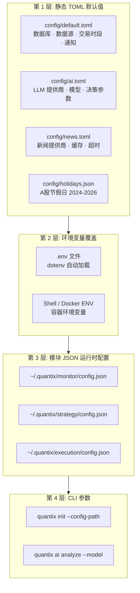
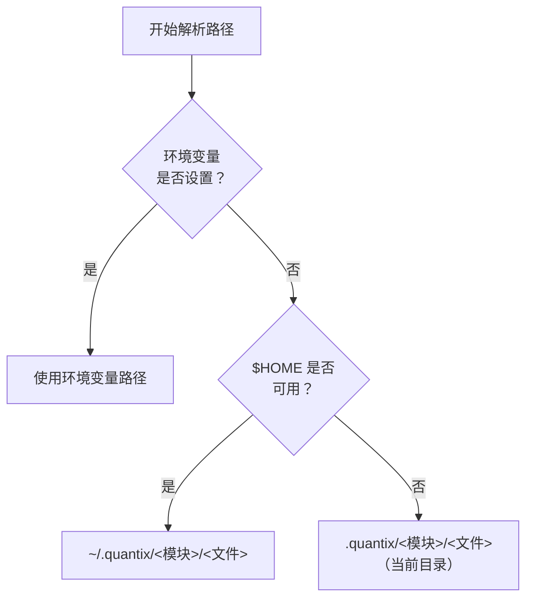
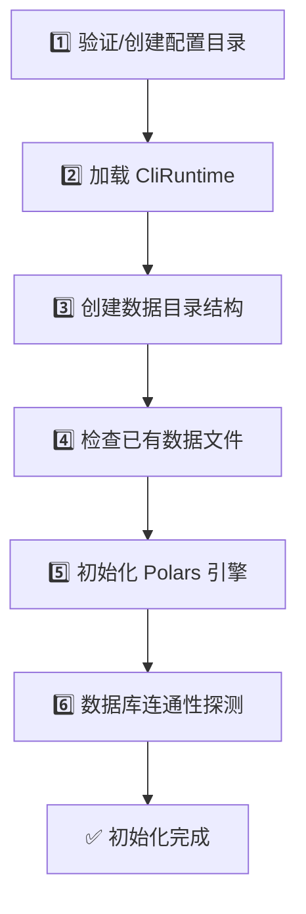

Quantix 的配置管理采用**分层叠加、环境优先**的设计哲学——从静态 TOML 默认值出发，经环境变量覆盖，最终落入模块级 JSON 运行时状态，形成一个清晰的优先级链。理解这套机制，是正确部署开发、测试和生产环境的前提。

Sources: [config.rs](src/core/config.rs#L1-L97), [runtime.rs](src/core/runtime.rs#L1-L270)

## 配置体系全景

项目配置从来源到消费，经历四个层级。每一层都可以覆盖上一层的值，最终效果是「**最后写入者胜出**」。



Sources: [default.toml](config/default.toml#L1-L87), [ai.toml](config/ai.toml#L1-L72), [news.toml](config/news.toml#L1-L57), [holidays.json](config/holidays.json#L1-L44)

## 第 1 层：静态 TOML 默认值

项目根目录下的 `config/` 文件夹存放了所有静态配置文件。这些文件通过 `config` crate（版本 0.13）以分层合并的方式加载到 `AppConfig` 结构体中。

### 核心配置文件一览

| 文件 | 用途 | 主要配置项 |
|------|------|-----------|
| `config/default.toml` | 全局默认值 | 数据库连接、数据源地址、交易时段、通知渠道 |
| `config/ai.toml` | AI 决策模块 | LLM 提供商选择、模型映射、温度/Token 上限 |
| `config/news.toml` | 新闻搜索模块 | 搜索提供商优先级、缓存 TTL、超时设置 |
| `config/holidays.json` | A股交易日历 | 2024-2026 年节假日、调休补班日 |

`AppConfig` 结构体是全局配置的入口点，通过 `config::Config` builder 的**多源叠加**机制构建：

```rust
// src/core/config.rs 中的加载逻辑
pub fn load(config_dir: &str) -> Result<Self, Box<dyn std::error::Error>> {
    let mut builder = Config::builder()
        .add_source(config::File::with_name("config/default"))  // ① 先加载默认文件
        .add_source(Environment::default().separator("__"));     // ② 环境变量覆盖

    // ③ 如果指定了额外配置目录，继续叠加
    if Path::new(config_dir).exists() {
        let config_file = Path::new(config_dir).join("data_sources.toml");
        if config_file.exists() {
            builder = builder.add_source(config::File::from(config_file));
        }
    }

    let config = builder.build()?;
    config.try_deserialize()  // 反序列化为 AppConfig
}
```

这里有一个关键细节：`Environment::default().separator("__")` 表示环境变量名使用**双下划线**作为层级分隔符。例如 `DATABASE__TDENGINE__HOST=tcp://...` 会覆盖 `config/default.toml` 中 `[database.tdengine].host` 的值。

Sources: [config.rs](src/core/config.rs#L76-L96), [default.toml](config/default.toml#L1-L27)

### default.toml 结构解读

`config/default.toml` 定义了系统启动所需的全部基础配置：

```toml
# 数据库连接
[database.tdengine]
host = "localhost"
port = 6041
database = "quantix"
mode = "rest"          # 支持 "rest" 或 "websocket" 两种协议

[database.postgresql]
host = "localhost"
port = 5432
pool_max_size = 10     # 连接池大小

# 数据源
[data_sources.tdx]
hosts = ["114.80.63.12", "114.80.63.13"]  # TDX 服务器列表
port = 7709
timeout = 5000                            # 毫秒

# 交易时段
[trading]
morning_start = "09:30:00"
afternoon_end = "15:00:00"

# 通知渠道
[notification]
enabled_channels = ["log"]  # 默认只启用日志通知
min_level = "warning"
```

Sources: [default.toml](config/default.toml#L1-L87)

## 第 2 层：环境变量覆盖

环境变量是连接「不同部署环境」与「统一代码库」的桥梁。Quantix 使用 `dotenv` crate（版本 0.15）在启动时自动加载项目根目录下的 `.env` 文件。

### .env 文件的结构

`.env.example` 提供了完整的环境变量模板，按功能分组：

| 配置分组 | 关键环境变量 | 说明 |
|---------|------------|------|
| **数据库** | `CLICKHOUSE_URL`, `POSTGRES_HOST` | ClickHouse 和 PostgreSQL 连接地址 |
| **数据源** | `TDX_HOSTS`, `AKSHARE_BASE_URL` | 行情数据源地址 |
| **AI 提供商** | `DEEPSEEK_API_KEY`, `OPENAI_API_KEY` | LLM API 密钥，存在即启用 |
| **新闻搜索** | `TAVILY_API_KEY`, `SERPAPI_API_KEY` | 新闻搜索 API 密钥 |
| **通知渠道** | `WECHAT_WORK_WEBHOOK_URL`, `FEISHU_WEBHOOK_URL` | Webhook 通知地址 |
| **路径覆盖** | `QUANTIX_WATCHLIST_PATH`, `QUANTIX_TRADE_PATH` | 自定义数据文件路径 |
| **运行时** | `RUST_LOG`, `QUANTIX_CONFIG_DIR` | 日志级别和配置目录 |

### CliRuntime：环境变量的统一消费入口

`CliRuntime` 是应用运行时配置的**聚合根**，它在 `load()` 方法中一次性收集所有环境变量：

```rust
// src/core/runtime.rs
impl CliRuntime {
    pub fn load() -> Self {
        load_dotenv_if_present();  // 自动加载 .env
        Self {
            clickhouse: ClickHouseSettings::from_env(),
            bridge: BridgeRuntimeSettings::from_env(),
            upstream_mysql: UpstreamMySqlSettings::from_env(),
            watchlist_path: resolve_watchlist_path(),
            trade_path: resolve_trade_path(),
            risk_path: resolve_risk_path(),
            monitor_db_path: resolve_monitor_db_path(),
            strategy_config_path: resolve_strategy_config_path(),
            execution_config_path: resolve_execution_config_path(),
        }
    }
}

fn load_dotenv_if_present() {
    let _ = dotenv::dotenv();  // 静默忽略：文件不存在时不报错
}
```

每个子设置（如 `ClickHouseSettings`）都遵循相同的模式：通过 `std::env::var()` 读取环境变量，缺失时使用编译期常量作为默认值。这保证了**即使不设置任何环境变量，系统也能以 localhost 默认配置启动**。

Sources: [runtime.rs](src/core/runtime.rs#L92-L109), [.env.example](.env.example#L1-L105), [config.rs](src/core/config.rs#L8-L23)

### 三级路径解析策略

对于本地文件路径（如 watchlist 存储、交易记录、风控状态），Quantix 采用**统一的三级解析策略**：



以 watchlist 路径为例：

```rust
fn resolve_watchlist_path() -> PathBuf {
    // 优先级 1: 环境变量
    if let Some(path) = std::env::var_os(WATCHLIST_PATH_ENV) {
        return PathBuf::from(path);
    }
    // 优先级 2: $HOME 目录
    if let Some(home) = std::env::var_os("HOME") {
        return PathBuf::from(home)
            .join(".quantix").join("watchlist").join("watchlist.json");
    }
    // 优先级 3: 当前目录
    PathBuf::from(".quantix").join("watchlist").join("watchlist.json")
}
```

这意味着：
- **开发环境**：数据自动存放在 `~/.quantix/` 下，无需手动配置
- **Docker 环境**：通过 `QUANTIX_WATCHLIST_PATH` 等变量指向容器内挂载路径
- **CI 环境**：即使没有 `$HOME`，也能回退到相对路径

Sources: [runtime.rs](src/core/runtime.rs#L127-L142)

## 第 3 层：模块级 JSON 运行时配置

对于需要**在运行时动态修改**的配置（如监控间隔、策略参数、执行审批策略），Quantix 为每个业务模块提供了独立的 JSON 配置存储。

### 模块配置一览

| 模块 | 配置结构体 | 默认存储路径 | 关键配置项 |
|------|-----------|------------|-----------|
| 监控 | `MonitorConfig` | `~/.quantix/monitor/config.json` | 采样间隔、最大事件历史 |
| 监控服务 | `MonitorServiceConfig` | `~/.quantix/monitor/service.json` | 可执行文件路径 |
| 策略 | `StrategyDaemonConfig` | `~/.quantix/strategy/config.json` | 检查间隔、股票策略列表 |
| 策略服务 | `StrategyServiceConfig` | `~/.quantix/strategy/service.json` | 可执行文件路径、环境文件 |
| 执行 | `ExecutionDaemonConfig` | `~/.quantix/execution/config.json` | 轮询间隔、自动审批模式 |

### 统一的 ConfigStore 模式

所有模块配置存储都遵循相同的 `JsonXxxConfigStore` 模式，提供四个核心能力：

```rust
// 以 ExecutionDaemonConfig 为例
impl JsonExecutionConfigStore {
    pub fn with_default_path() -> Result<Self> { /* 解析到 ~/.quantix/... */ }
    pub fn load(&self) -> Result<ExecutionDaemonConfig> { /* 读取 JSON */ }
    pub fn load_or_create(&self) -> Result<ExecutionDaemonConfig> { /* 不存在则创建默认值 */ }
    pub fn save(&self, config: &ExecutionDaemonConfig) -> Result<()> { /* 原子写入 */ }
}
```

**原子写入**是这里的关键设计：先写入临时文件 `.tmp`，再通过 `std::fs::rename()` 原子性地替换目标文件。这确保了即使写入过程中进程崩溃，也不会产生损坏的半成品配置文件：

```rust
pub fn save(&self, config: &ExecutionDaemonConfig) -> Result<()> {
    // 确保父目录存在
    if let Some(parent) = self.path.parent() {
        std::fs::create_dir_all(parent)?;
    }
    // 写入临时文件 → 原子重命名
    let tmp_path = self.path.with_extension("tmp");
    std::fs::write(&tmp_path, serde_json::to_string_pretty(config)?)?;
    std::fs::rename(tmp_path, &self.path)?;
    Ok(())
}
```

**首次使用自动引导**（`load_or_create`）让新用户零配置上手：如果配置文件不存在，自动生成默认配置并持久化，保证下次读取时文件一定存在：

```rust
pub fn load_or_create(&self) -> Result<ExecutionDaemonConfig> {
    if self.path.exists() {
        return self.load();
    }
    let config = ExecutionDaemonConfig::default();
    self.save(&config)?;  // 持久化默认值
    Ok(config)
}
```

Sources: [execution/config.rs](src/execution/config.rs#L1-L99), [monitor/config.rs](src/monitor/config.rs#L1-L63), [strategy/config.rs](src/strategy/config.rs#L1-L112)

## AI 与新闻模块的配置特殊性

AI 决策模块和新闻搜索模块采用了与核心配置不同的加载模式——**纯环境变量驱动**，不依赖 TOML 文件反序列化。

### AI 模块：LlmConfig.from_env()

`LlmConfig` 不从 TOML 文件加载，而是通过 `from_env()` 方法逐一检查各 LLM 提供商的环境变量。**只要某个提供商的 API Key 存在，该提供商就被视为可用**：

```rust
impl LlmConfig {
    pub fn from_env() -> Self {
        let mut config = Self::default();  // 默认 deepseek-chat
        // ... 读取通用参数 ...
        config.load_provider_configs();    // 扫描所有提供商 API Key
        config
    }

    fn load_provider_configs(&mut self) {
        if let Ok(api_key) = std::env::var("DEEPSEEK_API_KEY") { /* 注册 DeepSeek */ }
        if let Ok(api_key) = std::env::var("OPENAI_API_KEY") { /* 注册 OpenAI */ }
        if let Ok(api_key) = std::env::var("GEMINI_API_KEY") { /* 注册 Gemini */ }
        if let Ok(api_key) = std::env::var("ANTHROPIC_API_KEY") { /* 注册 Anthropic */ }
        // Ollama 不需要 API Key，检测 OLLAMA_API_BASE 或 OLLAMA_HOST
    }
}
```

`config/ai.toml` 文件中的配置目前主要用于**参考和文档化**目的，记录了各提供商的 base_url 和默认参数，实际运行时配置来源于环境变量。

Sources: [adapter.rs](src/ai/adapter.rs#L83-L188), [ai.toml](config/ai.toml#L1-L72)

### 新闻模块：提供商检测模式

新闻搜索模块同样采用环境变量检测方式。`run_news_command` 在执行时直接检查 `TAVILY_API_KEY`、`SERPAPI_API_KEY`、`BOCHA_API_KEY` 是否存在，以此判断可用提供商。`config/news.toml` 中定义了提供商的优先级（priority 字段），但实际 API Key 必须通过环境变量提供。

Sources: [news.rs](src/cli/handlers/news.rs#L48-L61), [news.toml](config/news.toml#L1-L57)

## Docker 环境配置

Docker 部署通过 `docker-compose.yml` 和 `docker-compose.prod.yml` 两个文件区分开发与生产环境，利用 Docker 的环境变量和卷挂载机制实现配置分离。

### 开发环境 vs 生产环境对比

| 维度 | 开发环境 (`docker-compose.yml`) | 生产环境 (`docker-compose.prod.yml`) |
|------|------|------|
| **镜像来源** | 本地构建 (`build: .`) | GHCR 远程镜像 (`image: ghcr.io/...`) |
| **数据库密码** | 明文硬编码 (`quantix123`) | 必须通过环境变量传入 (`${POSTGRES_PASSWORD:?...}`) |
| **资源限制** | 无限制 | CPU/内存配额（2C/4G 限制） |
| **日志策略** | 默认 | `json-file` 驱动，100MB 上限 |
| **重启策略** | `unless-stopped` | `always` + 失败重试策略 |
| **Traefik 网关** | 无 | 集成 TLS + Let's Encrypt |

生产环境的 Compose 文件通过 `${VAR:?error message}` 语法**强制要求**关键密码变量存在。例如 `POSTGRES_PASSWORD:?POSTGRES_PASSWORD required` 表示如果未设置 `POSTGRES_PASSWORD`，docker compose 将直接报错退出，而不是使用空密码。

在 Dockerfile 中，`config` 目录被以**只读方式**挂载（`./config:/app/config:ro`），确保容器不会修改静态配置文件。

Sources: [docker-compose.yml](docker-compose.yml#L1-L89), [docker-compose.prod.yml](docker-compose.prod.yml#L1-L113), [Dockerfile](Dockerfile#L53-L76)

## 初始化流程：quantix init

`quantix init` 命令是理解配置加载全流程的最佳入口。它执行以下六个步骤：



1. **配置目录**：验证 `--config-path` 指定的目录是否存在，不存在则创建
2. **CliRuntime**：调用 `CliRuntime::load()` 从环境变量聚合所有运行时配置
3. **数据目录**：基于 `CliRuntime` 中解析的路径，创建 watchlist、trade、risk、monitor、strategy、execution 六个模块的存储目录
4. **已有数据**：扫描数据文件的大小，提供已存储数据的概览
5. **Polars 引擎**：初始化列式计算引擎，设置线程数
6. **连通性探测**：异步并行检测 ClickHouse、MySQL、Bridge 三个服务的 TCP 可达性

Sources: [app_shell.rs](src/cli/handlers/app_shell.rs#L3-L150)

## 交易日历的配置加载

交易日历（`TradingCalendar`）是配置加载中的一个特殊案例——它从 JSON 文件加载静态节假日数据，并支持多路径回退：

```rust
pub async fn from_default_config() -> Result<Self> {
    let default_paths = vec![
        PathBuf::from("config/holidays.json"),      // ① 项目相对路径
        PathBuf::from("/etc/quantix/holidays.json"), // ② 系统级路径
    ];
    for path in default_paths {
        if path.exists() {
            return Self::from_config(&path).await;
        }
    }
    tracing::warn!("未找到节假日配置文件，使用空节假日数据");
    Self::new().await  // ③ 无配置时使用空数据
}
```

`config/holidays.json` 包含 2024-2026 年的 A 股节假日数据，包括调休工作日（`workdays_on_weekend`）。每个交易日的判断逻辑为：**排除周末，排除节假日，恢复调休工作日**。

Sources: [trading_calendar.rs](src/core/trading_calendar.rs#L107-L133), [holidays.json](config/holidays.json#L1-L44)

## 配置错误处理

所有配置相关的错误都归入 `QuantixError::Config(String)` 变体。模块级配置存储在以下场景抛出明确错误：

- **路径不可达**：`quantix_bin_path 必须是绝对路径` / `不存在` / `不可执行`
- **文件损坏**：`serde_json::from_str` 反序列化失败自动转化为 `QuantixError::Serialization`
- **HOME 缺失**：`HOME is required for xxx config`

建议开发者在修改 JSON 配置文件时，先通过 `serde_json::to_string_pretty()` 验证格式合法性，或直接使用 CLI 命令（如 `quantix strategy config`）来安全修改。

Sources: [error.rs](src/core/error.rs#L8-L9), [service_config.rs](src/strategy/service_config.rs#L60-L90)

## 常见配置场景速查

| 场景 | 操作 |
|------|------|
| **本地开发首次启动** | 复制 `.env.example` 为 `.env`，填入数据库地址 |
| **添加 DeepSeek AI** | 在 `.env` 中设置 `DEEPSEEK_API_KEY=sk-xxx` |
| **修改监控采样间隔** | 编辑 `~/.quantix/monitor/config.json` 的 `interval_seconds` |
| **切换 LLM 提供商** | 设置 `LLM_PROVIDER=openai`（CLI 参数）或仅配置目标提供商的 API Key |
| **Docker 生产部署** | 设置 `POSTGRES_PASSWORD`、`CLICKHOUSE_PASSWORD`、`GRAFANA_ADMIN_PASSWORD` |
| **自定义数据路径** | 设置 `QUANTIX_WATCHLIST_PATH` 等环境变量 |
| **添加节假日数据** | 编辑 `config/holidays.json`，新增年份的 holidays 和 workdays_on_weekend |

---

**下一步阅读建议**：配置加载后，系统如何处理运行时异常？请参阅 [统一错误处理与异步运行时](6-tong-cuo-wu-chu-li-yu-yi-bu-yun-xing-shi)。如果对交易日历的判断逻辑感兴趣，可以直接跳转 [A股交易日历与时段判断](7-agu-jiao-yi-ri-li-yu-shi-duan-pan-duan)。对于数据库连接的完整配置流程，参见 [多数据库集成（ClickHouse/PostgreSQL/TDengine）](9-duo-shu-ju-ku-ji-cheng-clickhouse-postgresql-tdengine)。