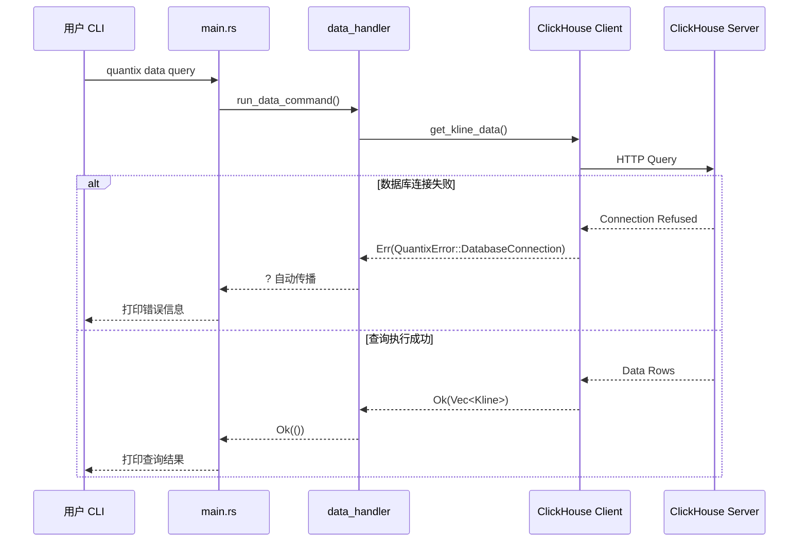
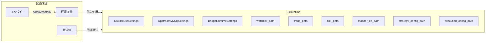

量化交易系统需要在网络 I/O、数据库操作、行情解析、风控评估等多条路径上保持**错误信息的一致性和可追溯性**。本项目通过 `QuantixError` 统一枚举 + `thiserror` 派生宏，在全局范围内建立了一套类型安全的错误体系；同时基于 **Tokio 异步运行时**构建了从 CLI 入口到执行引擎的全链路异步调用栈。本页将帮助初学者理解这两大基础设施的设计意图、实现方式和实际使用模式。

Sources: [error.rs](src/core/error.rs#L1-L58), [main.rs](src/main.rs#L1-L24)

## 错误体系架构总览

项目的错误处理遵循 **「统一枚举 + 领域子类型」** 的分层策略。顶层是一个全局 `QuantixError` 枚举，覆盖配置、数据库、网络、IO、序列化等常见场景；各子系统（Bridge、Execution、Algo）定义自己的领域错误类型，通过 `From` 转换或 `map_err` 映射到 `QuantixError`。

```mermaid
graph TD
    subgraph 全局错误层
        QE[QuantixError<br/>统一错误枚举]
        RT[Result&lt;T&gt;<br/>类型别名]
    end

    subgraph 外部依赖错误
        IO[std::io::Error]
        SJ[serde_json::Error]
        SQ[sqlx::Error]
        RQ[reqwest::Error]
    end

    subgraph 领域错误层
        BE[BridgeError<br/>Bridge 通信]
        AE[AdapterError<br/>执行适配器]
        ALE[AlgoError<br/>算法交易]
    end

    subgraph 使用方
        CLI[CLI Handlers]
        DB[DB Clients]
        NEWS[News Providers]
        EXEC[Execution Kernel]
    end

    IO -->|#[from] 自动转换| QE
    SJ -->|#[from] 自动转换| QE
    SQ -->|#[from] 自动转换| QE
    RQ -->|#[from] 自动转换| QE

    BE -->|From impl| QE
    ALE -->|From impl| QE
    AE -->|map_err| QE

    CLI --> RT
    DB --> RT
    NEWS --> RT
    EXEC --> RT
```

Sources: [error.rs](src/core/error.rs#L1-L58), [bridge/error.rs](src/bridge/error.rs#L1-L13), [execution/adapter.rs](src/execution/adapter.rs#L36-L46), [execution/algo/executor.rs](src/execution/algo/executor.rs#L16-L41)

## QuantixError：全局统一错误枚举

`QuantixError` 是整个项目的错误中枢。它通过 `thiserror::Error` 派生宏自动实现 `std::error::Error` 和 `Display` trait，每个变体都带有中文错误描述模板，便于日志输出和用户阅读。

### 错误变体一览

| 变体 | 含义 | 转换方式 | 典型使用场景 |
|------|------|----------|-------------|
| `Config(String)` | 配置文件或环境变量错误 | `map_err` | API Key 缺失、配置项非法 |
| `DatabaseConnection(String)` | 数据库连接失败 | `map_err` | ClickHouse/PostgreSQL/TDengine 连接异常 |
| `DatabaseQuery(String)` | SQL 查询执行失败 | `map_err` | 查询语法错误、表不存在 |
| `DataSource(String)` | 数据源适配器错误 | `map_err` | TDX 文件读取、API 响应异常 |
| `DataParse(String)` | 数据解析/反序列化失败 | `map_err` | CSV 解析、JSON 字段缺失 |
| `Timeout(String)` | 操作超时 | `map_err` | 网络请求超时、执行超时 |
| `Io(#[from] std::io::Error)` | IO 错误 | **自动转换** | 文件读写、网络 IO |
| `Serialization(#[from] serde_json::Error)` | JSON 序列化错误 | **自动转换** | JSON 解析失败 |
| `Sqlx(#[from] sqlx::Error)` | SQLx 数据库错误 | **自动转换** | PostgreSQL/MySQL 查询失败 |
| `Http(#[from] reqwest::Error)` | HTTP 请求错误 | **自动转换** | API 调用网络失败 |
| `Network(String)` | 通用网络错误 | `map_err` | 新闻搜索、Bridge 通信 |
| `Unsupported(String)` | 功能暂不支持 | 直接构造 | 未实现的 API 方法 |
| `Algo(String)` | 算法交易错误 | `From<AlgoError>` | TWAP/VWAP 执行失败 |
| `Other(String)` | 其他未分类错误 | `map_err` | 业务逻辑异常兜底 |

关键设计点在于两种转换方式的使用：**`#[from]` 属性**让 Rust 编译器自动生成 `From` 实现，使 `?` 操作符可以直接将底层错误转换为 `QuantixError`；而 **`map_err`** 则用于需要添加中文上下文描述的场景。例如数据库查询失败时，代码会将原始错误包装为 `QuantixError::DatabaseQuery("查询 K线数据失败: ...")`，让错误信息既保留了原始原因，又附加了业务语义。

Sources: [error.rs](src/core/error.rs#L1-L58)

### Result 类型别名

项目通过 `pub type Result<T> = std::result::Result<T, QuantixError>` 定义了统一的 Result 别名，整个项目中 743 处引用均使用这一类型。这意味着所有函数签名中 `Result<()>` 的默认错误类型就是 `QuantixError`，降低了认知负担，也让 `?` 操作符的使用变得自然流畅。

```rust
// src/core/error.rs — 全局 Result 类型别名
pub type Result<T> = std::result::Result<T, QuantixError>;
```

在 `lib.rs` 中通过 `pub use core::{QuantixError, Result}` 重新导出，使得任何模块只需 `use crate::core::Result` 即可使用统一类型。

Sources: [error.rs](src/core/error.rs#L51), [lib.rs](src/lib.rs#L47)

## 领域错误类型：子系统的专用错误枚举

虽然 `QuantixError` 覆盖了大部分场景，但某些子系统定义了**更细粒度的领域错误**。这些类型在子系统内部使用，最终通过 `From` 实现或 `map_err` 桥接到 `QuantixError`。

### BridgeError — Bridge 通信错误

```rust
// src/bridge/error.rs
#[derive(Debug, Error)]
pub enum BridgeError {
    #[error("bridge config error: {0}")]
    Config(String),
    #[error("bridge request failed: {0}")]
    Http(#[from] reqwest::Error),
}
```

Bridge 模块作为与外部 Bridge 服务通信的客户端，只需关注配置和 HTTP 两类错误。使用独立的 `BridgeError` 可以让 Bridge 内部的函数签名更精确，同时在需要向上传播时通过 `.map_err()` 转换。

### AdapterError — 执行适配器错误

```rust
// src/execution/adapter.rs
#[derive(Debug, Error, PartialEq, Eq)]
pub enum AdapterError {
    #[error("execution adapter 暂不支持: {0}")]
    Unsupported(String),
    #[error("execution adapter 执行失败: {0}")]
    Execution(String),
    #[error("execution adapter 网络错误: {0}")]
    Network(String),
}
```

`AdapterError` 是 `ExecutionAdapter` trait 的返回类型，精确定义了执行层可能遇到的三类异常。特别注意它额外 derive 了 `PartialEq, Eq`，这是为了在测试中精确断言适配器返回了预期的错误类型。

### AlgoError — 算法交易错误

```rust
// src/execution/algo/executor.rs
#[derive(Debug, thiserror::Error)]
pub enum AlgoError {
    #[error("Invalid parameters: {0}")]
    InvalidParams(String),
    #[error("Algorithm not found: {0}")]
    NotFound(String),
    #[error("Algorithm already running: {0}")]
    AlreadyRunning(String),
    #[error("Order failed: {0}")]
    OrderFailed(String),
    #[error("Timeout exceeded")]
    Timeout,
    // ...
}
```

算法交易子系统的错误类型最为丰富，涵盖了参数校验、状态冲突、订单失败、市场数据不可用等场景。`QuantixError` 中通过显式 `From` 实现完成桥接：

```rust
// src/core/error.rs
impl From<crate::execution::algo::AlgoError> for QuantixError {
    fn from(err: crate::execution::algo::AlgoError) -> Self {
        QuantixError::Algo(err.to_string())
    }
}
```

这保证了算法模块内部可以使用自己的 `AlgoError`，但在调用链向上传播时自动转换为 `QuantixError::Algo(...)`。

Sources: [bridge/error.rs](src/bridge/error.rs#L1-L13), [execution/adapter.rs](src/execution/adapter.rs#L36-L46), [execution/algo/executor.rs](src/execution/algo/executor.rs#L15-L41), [error.rs](src/core/error.rs#L53-L57)

## 错误传播路径：从底层到用户

理解错误的传播路径，是掌握项目调试方法的关键。下面是一个典型场景——CLI 命令触发 K 线数据查询时的完整错误传播链：



错误传播遵循以下原则：

**1. 自动转换优先**：对于实现了 `From<ExternalError> for QuantixError` 的类型（`io::Error`、`serde_json::Error`、`sqlx::Error`、`reqwest::Error`），直接使用 `?` 操作符即可自动转换。

**2. 显式映射补充上下文**：对于 `String` 型变体（`Config`、`DatabaseQuery`、`Network` 等），使用 `.map_err(|e| QuantixError::Xxx(format!("中文描述: {}", e)))?` 的模式，在转换的同时附加业务语义。这种模式在整个项目的数据库层和新闻模块中广泛使用。

**3. 顶层统一返回**：`main.rs` 中的 `async fn main() -> Result<()>` 确保所有未捕获的错误最终都会以统一格式输出到终端。

Sources: [main.rs](src/main.rs#L12-L23), [cli/commands/mod.rs](src/cli/commands/mod.rs#L165-L250), [db/clickhouse/kline.rs](src/db/clickhouse/kline.rs#L42)

## 异步运行时：Tokio 架构

项目基于 **Tokio 1.35**（启用 `full` + `tracing` feature）构建异步运行时，这是 Rust 生态中最成熟的生产级异步框架。

### 入口与启动

```rust
// src/main.rs
#[tokio::main]
async fn main() -> Result<()> {
    // 初始化日志
    tracing_subscriber::fmt()
        .with_env_filter(
            std::env::var("RUST_LOG")
                .unwrap_or_else(|_| "quantix_cli=info,sqlx=warn".to_string()),
        )
        .init();

    // 解析 CLI 命令
    Cli::parse().run().await
}
```

`#[tokio::main]` 宏展开后创建一个多线程 Tokio 运行时，所有命令处理器均在此运行时中异步执行。日志系统使用 `tracing-subscriber`，默认级别为 `quantix_cli=info,sqlx=warn`——这意味着项目自身代码输出 INFO 级别日志，而 SQLx 数据库驱动只输出 WARN 及以上级别，避免大量查询日志淹没关键信息。

Sources: [main.rs](src/main.rs#L1-L24), [Cargo.toml](Cargo.toml#L26)

### 异步 Trait 模式：async_trait

由于 Rust 原生 async trait 在 2024 edition 下仍有局限，项目统一使用 `async_trait` 过程宏来定义异步 trait。这种方式在项目中大量使用：

```rust
// 数据获取接口
#[async_trait]
pub trait Fetcher: Send + Sync {
    async fn get_stock_info(&self, code: &str) -> Result<Option<StockInfo>>;
    async fn get_kline(&self, code: &str, start: NaiveDate, end: NaiveDate) -> Result<Vec<Kline>>;
    async fn check_connection(&self) -> Result<()>;
}

// 执行适配器接口
#[async_trait]
pub trait ExecutionAdapter: Send + Sync {
    async fn submit_order(&self, request: AdapterOrderRequest) -> Result<OrderInitialResponse, AdapterError>;
    async fn query_order(&self, order_id: &str) -> Result<OrderQueryResponse, AdapterError>;
    async fn cancel_order(&self, order_id: &str) -> Result<(), AdapterError>;
}

// 风控评估接口
#[async_trait]
pub trait RiskEvaluator: Send + Sync {
    async fn evaluate(&self, intent: OrderIntent) -> Result<RiskDecision>;
    async fn sync_after_fill(&self) -> Result<()>;
}
```

所有异步 trait 都约束了 `Send + Sync`，确保它们可以安全地在 Tokio 多线程运行时中跨任务传递。这种模式使得 **Paper 执行、MockLive 执行、QMT Live 执行**可以共享同一个 `ExecutionAdapter` 接口，在运行时通过依赖注入切换实现。

Sources: [data/fetcher.rs](src/data/fetcher.rs#L1-L26), [execution/adapter.rs](src/execution/adapter.rs#L48-L63), [execution/kernel/traits.rs](src/execution/kernel/traits.rs#L1-L19)

### 并发控制原语

项目在多个模块中使用了 Tokio 提供的并发控制原语：

| 原语 | 所在模块 | 用途 |
|------|---------|------|
| `tokio::sync::Semaphore` | `io/batch.rs`、`anomaly/detector.rs` | 限制并发数据导入/检测任务数 |
| `tokio::sync::RwLock` | `account/registry.rs`、`algo/executor.rs`、`tasks/` | 保护共享可变状态的读写并发 |
| `tokio::sync::Mutex` | `risk/service.rs` | 风控服务的互斥状态更新 |
| `tokio::time::sleep` | `tasks/collect_scheduler.rs`、`sync/etl.rs` | 定时调度间隔 |
| `tokio::time::timeout` | `watchlist/resolver.rs` | 网络请求超时控制 |
| `tokio::spawn` | `io/batch.rs`、`anomaly/detector.rs` | 并发任务派发 |
| `tokio::process::Command` | `monitoring/notification/desktop.rs` | 桌面通知命令执行 |

`Semaphore` 是最值得关注的并发控制原语。在批处理模块中，它通过 `max_concurrent_tasks` 参数（默认 4）限制同时运行的异步任务数，防止数据库或网络连接被耗尽：

```rust
// src/io/batch.rs — 批处理并发控制
use tokio::sync::Semaphore;

pub struct BatchConfig {
    pub batch_size: usize,
    pub max_concurrent_tasks: usize,  // 默认 4
    pub enable_progress: bool,
    pub memory_limit_mb: usize,
}
```

Sources: [io/batch.rs](src/io/batch.rs#L9-L33), [Cargo.toml](Cargo.toml#L26-L27)

## CliRuntime：运行时配置聚合

`CliRuntime` 是项目运行时环境的**配置聚合中心**，它将所有外部配置（数据库连接、文件路径、Bridge 设置）统一到一个结构体中，通过环境变量 + `.env` 文件加载。



每个路径配置都遵循**三级解析策略**：环境变量 → `$HOME/.quantix/...` → 相对路径 `.quantix/...`。这种设计让开发者在本地开发时无需配置任何环境变量（自动使用 `$HOME/.quantix/` 路径），在 CI/CD 或 Docker 环境中又可以通过环境变量精确覆盖。

Sources: [runtime.rs](src/core/runtime.rs#L70-L109)

## 实战模式：错误处理最佳实践

### 模式一：自动转换（`#[from]` + `?`）

当外部库的错误类型已注册 `#[from]` 时，`?` 操作符自动完成转换：

```rust
// 编译器自动生成 From<std::io::Error> for QuantixError
// 所以 ? 可以直接使用
let content = tokio::fs::read_to_string(&self.path).await?;
```

### 模式二：显式映射（`map_err` + 中文描述）

当需要附加业务语义时，使用 `map_err` 添加上下文：

```rust
// 数据库查询失败时附带中文说明
let klines = client
    .get_kline_data(&code, &period_type, start_date, end_date, Some(limit))
    .await
    .map_err(|e| QuantixError::DatabaseQuery(format!("查询 K线数据失败: {}", e)))?;
```

### 模式三：领域错误桥接到统一错误

子系统定义自己的错误枚举，通过 `From` 桥接到 `QuantixError`：

```rust
// AlgoError → QuantixError::Algo
impl From<crate::execution::algo::AlgoError> for QuantixError {
    fn from(err: crate::execution::algo::AlgoError) -> Self {
        QuantixError::Algo(err.to_string())
    }
}
```

### 模式四：未实现功能的占位错误

对于尚未接入的功能，使用 `Unsupported` 变体明确标记：

```rust
Err(QuantixError::Unsupported(
    "AkShareSource::get_stock_info 尚未接入真实 API".to_string(),
))
```

Sources: [error.rs](src/core/error.rs#L27-L36), [db/clickhouse/kline.rs](src/db/clickhouse/kline.rs#L42), [error.rs](src/core/error.rs#L53-L57), [sources/akshare.rs](src/sources/akshare.rs#L28-L31)

## 关键依赖版本

项目在错误处理和异步运行时方面依赖以下核心库：

| 库 | 版本 | 用途 |
|---|------|------|
| `tokio` | 1.35 (`full`, `tracing`) | 异步运行时 |
| `thiserror` | 1.0 | 错误类型派生宏 |
| `anyhow` | 1.0 | 通用错误处理（辅助使用） |
| `color-eyre` | 0.6 | 错误报告美化 |
| `async-trait` | 0.1 | 异步 trait 宏 |
| `tracing` | 0.1 | 结构化日志 |
| `tracing-subscriber` | 0.3 (`env-filter`, `json`) | 日志订阅器 |
| `sqlx` | 0.7 (`runtime-tokio`, `postgres`, `mysql`) | 异步数据库驱动 |
| `reqwest` | 0.11 (`json`, `cookies`) | 异步 HTTP 客户端 |

Sources: [Cargo.toml](Cargo.toml#L18-L98)

## 延伸阅读

- 了解配置加载的具体环境变量和文件路径规则：[配置管理与多环境加载机制](5-pei-zhi-guan-li-yu-duo-huan-jing-jia-zai-ji-zhi)
- 了解异步执行引擎如何利用这些错误类型：[ExecutionKernel 执行生命周期与风控评估](12-executionkernel-zhi-xing-sheng-ming-zhou-qi-yu-feng-kong-ping-gu)
- 了解性能计时和内存追踪工具：[性能优化指南](30-xing-neng-you-hua-zhi-nan-polars-pi-liang-ji-suan-yu-criterion-ji-zhun-ce-shi)
- 了解编码层面的模块组织方式：[Rust 编码规范](28-rust-bian-ma-gui-fan-wen-jian-chai-fen-mo-kuai-zu-zhi-lei-xing-an-quan)