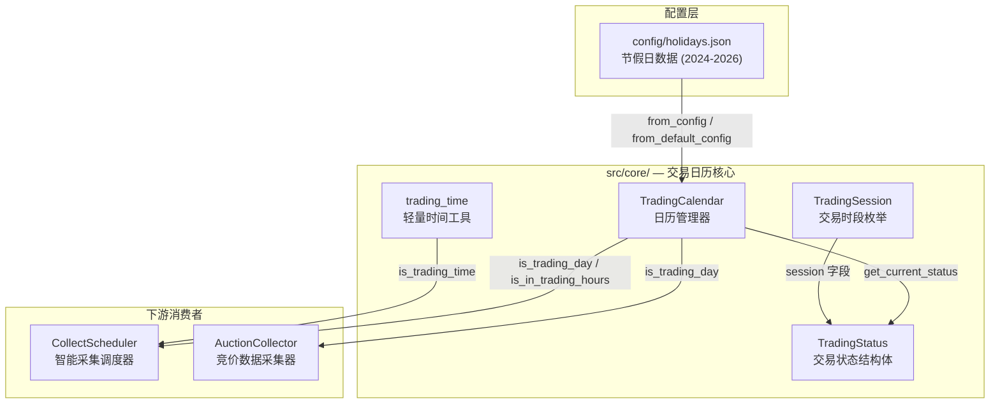
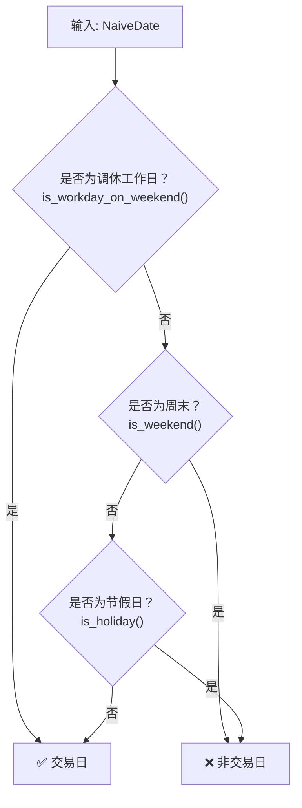
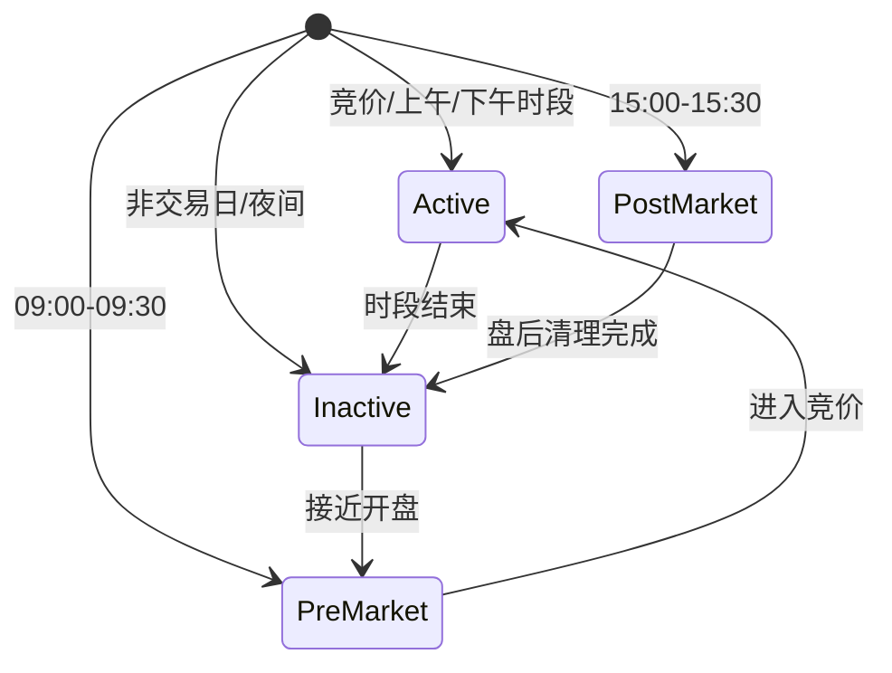

在量化交易系统中，**精确判断"今天是否交易日"和"当前处于哪个交易时段"是所有调度逻辑的基石**。Quantix 的交易日历模块基于中国 A 股市场的实际规则构建——涵盖节假日判定、调休补班机制、四段式交易时段识别，以及动态采集间隔建议。本文将从架构总览出发，逐层拆解核心数据结构、配置加载机制、判断逻辑与下游集成方式。

Sources: [trading_calendar.rs](src/core/trading_calendar.rs#L1-L4), [trading_time.rs](src/core/trading_time.rs#L1-L4)

## 模块架构总览

交易日历功能由两个互补的 Rust 模块协同实现，共同归属于 `src/core/` 核心基础设施层。**`trading_calendar`** 是主模块，提供完整的节假日配置加载、交易日判定和实时交易状态查询；**`trading_time`** 则是一个轻量级的辅助模块，仅包含无状态的纯函数，适合不需要节假日精确性的快速时间判断场景。



Sources: [mod.rs](src/core/mod.rs#L8-L9), [trading_calendar.rs](src/core/trading_calendar.rs#L76-L85), [trading_time.rs](src/core/trading_time.rs#L7-L11)

## 交易时段枚举：TradingSession

**`TradingSession`** 是整个交易日历体系的核心类型抽象，定义了 A 股交易日的四个时段状态。该枚举同时实现了序列化/反序列化（`Serialize`/`Deserialize`），可直接用于 JSON 配置持久化和 API 返回。

| 枚举值 | 含义 | 时间范围 | `as_str()` | `display_name()` |
|--------|------|----------|------------|-------------------|
| `Auction` | 集合竞价 | 09:15 – 09:25 | `"auction"` | `"集合竞价"` |
| `Morning` | 上午连续竞价 | 09:30 – 11:30 | `"morning"` | `"上午交易"` |
| `Afternoon` | 下午连续竞价 | 13:00 – 15:00 | `"afternoon"` | `"下午交易"` |
| `Closed` | 休市（含午休） | 其余所有时间 | `"closed"` | `"休市"` |

值得注意的是，**午休时段（11:31 – 12:59）虽然落在交易日内的非交易时间，但仍被归为 `Closed`**。这意味着 `Closed` 并不等价于"非交易日"，需要结合 `TradingStatus.is_trading_day` 字段才能完整判断。

Sources: [trading_calendar.rs](src/core/trading_calendar.rs#L10-L40)

## 交易状态结构体：TradingStatus

**`TradingStatus`** 将日期维度的"是否交易日"与时间维度的"当前时段"打包为一个统一的运行时状态快照，由 `TradingCalendar::get_current_status()` 方法一次性返回，避免调用方多次查询产生的时间窗口不一致问题。

```rust
pub struct TradingStatus {
    pub is_trading_day: bool,          // 是否为交易日
    pub current_session: TradingSession, // 当前交易时段
    pub next_open_time: chrono::DateTime<Local>, // 下次开盘时间
}
```

`next_open_time` 的计算逻辑覆盖三种场景：当日尚未开盘时指向当日 09:15；上午盘中指向下午 13:00；下午收盘后向前搜索下一个交易日并指向其 09:15。这为需要"倒计时到下次交易"的场景（如调度器休眠唤醒）提供了直接的时间锚点。

Sources: [trading_calendar.rs](src/core/trading_calendar.rs#L43-L51), [trading_calendar.rs](src/core/trading_calendar.rs#L326-L403)

## TradingCalendar 日历管理器

### 数据结构

**`TradingCalendar`** 是交易日历的核心状态持有者，内部以 `HashMap<i32, HashSet<NaiveDate>>` 的形式按年份缓存节假日和调休工作日数据，支持 O(1) 的日期查找。

```rust
pub struct TradingCalendar {
    holidays: HashMap<i32, HashSet<NaiveDate>>,           // 节假日缓存
    workdays_on_weekend: HashMap<i32, HashSet<NaiveDate>>, // 周末补班日缓存
    config_path: Option<std::path::PathBuf>,               // 配置文件路径
}
```

Sources: [trading_calendar.rs](src/core/trading_calendar.rs#L77-L85)

### 实例化路径

`TradingCalendar` 提供三条实例化路径，形成从最简单到最完整的渐进式配置能力：

| 方法 | 行为 | 适用场景 |
|------|------|----------|
| `new()` | 创建空日历，无节假日数据 | 测试、不需要节假日判断的快速启动 |
| `from_config(path)` | 从指定 JSON 文件加载节假日 | 自定义配置路径的生产部署 |
| `from_default_config()` | 按优先级搜索默认路径 | 标准部署，推荐使用 |

`from_default_config()` 按以下优先级搜索配置文件：先查找项目相对路径 `config/holidays.json`，再查找系统路径 `/etc/quantix/holidays.json`。若均不存在，则回退到空日历并输出警告日志，保证系统不会因缺少配置而崩溃。

Sources: [trading_calendar.rs](src/core/trading_calendar.rs#L97-L133)

### 节假日配置文件格式

配置文件 [config/holidays.json](config/holidays.json) 以 JSON 格式组织，按年份分组，每年度包含三个数组：

```json
{
  "description": "A股市场节假日数据 (2024-2026)",
  "source": "上海证券交易所/深圳证券交易所公告",
  "years": {
    "2026": {
      "holidays": ["2026-01-01", "2026-01-02", ...],
      "early_close": [],
      "workdays_on_weekend": ["2026-02-14", "2026-02-28", ...]
    }
  }
}
```

| 字段 | 含义 | 当前数据覆盖 |
|------|------|-------------|
| `holidays` | 法定节假日，这些日期即使落在工作日也不交易 | 2024 – 2026 |
| `early_close` | 提前收盘日（预留字段，当前为空） | — |
| `workdays_on_weekend` | 调休补班日，这些日期虽然落在周末但仍交易 | 2024 – 2026 |

Sources: [holidays.json](config/holidays.json#L1-L44), [trading_calendar.rs](src/core/trading_calendar.rs#L54-L74)

### 交易日判定逻辑

`is_trading_day(date)` 方法按严格的优先级链执行三步判断，这是整个模块最核心的决策逻辑：



**第一步：调休工作日优先判定**。中国 A 股市场特有的调休制度意味着某些周末（如春节前后的周六/周日）需要补班交易。这一步的优先级最高——只要日期出现在 `workdays_on_weekend` 集合中，直接返回 `true`，无需继续判断。

**第二步：周末过滤**。非调休的周六/周日直接排除，使用 `chrono::Weekday::Sat | Sun` 模式匹配。

**第三步：节假日排除**。在工作日中查找是否匹配 `holidays` 集合。若该年份没有加载节假日数据，则保守地返回 `false`（即视为非节假日，允许交易）。

Sources: [trading_calendar.rs](src/core/trading_calendar.rs#L184-L202), [trading_calendar.rs](src/core/trading_calendar.rs#L406-L431)

### 交易时段检测

`is_in_trading_hours()` 和 `get_current_status()` 均基于相同的时段常量进行实时判断。TradingCalendar 将 A 股交易时间硬编码为六个常量元组，确保时间边界在整个模块中保持一致：

| 常量 | 值 | 含义 |
|------|----|------|
| `AUCTION_START` | `(9, 15, 0)` | 集合竞价开始 |
| `AUCTION_END` | `(9, 25, 0)` | 集合竞价结束 |
| `MORNING_START` | `(9, 30, 0)` | 上午连续竞价开始 |
| `MORNING_END` | `(11, 30, 0)` | 上午连续竞价结束 |
| `AFTERNOON_START` | `(13, 0, 0)` | 下午连续竞价开始 |
| `AFTERNOON_END` | `(15, 0, 0)` | 下午连续竞价结束 |

`get_current_status()` 在交易日内的时段判断采用从早到晚的顺序匹配：先检查竞价时段，再检查上午，最后检查下午。如果当前时间不落在任何时段内（如午休 11:31-12:59 或盘前/盘后），则返回 `Closed`。

Sources: [trading_calendar.rs](src/core/trading_calendar.rs#L88-L94), [trading_calendar.rs](src/core/trading_calendar.rs#L258-L314)

### 动态采集间隔建议

**`get_recommended_interval()`** 根据当前交易状态返回不同的采集频率建议，实现了"交易时段高频采集、非交易时段低频心跳"的资源优化策略：

| 状态 | 建议间隔 | 场景说明 |
|------|---------|---------|
| `Auction` | 30 秒 | 竞价期间数据变化快，需密集采集 |
| `Morning` | 60 秒 | 上午连续竞价，标准采集频率 |
| `Afternoon` | 60 秒 | 下午连续竞价，标准采集频率 |
| `Closed`（交易日午休） | 300 秒（5 分钟） | 午休期间适度检查 |
| `Closed`（非交易日） | 1800 秒（30 分钟） | 节假日/周末，最低频率心跳 |

Sources: [trading_calendar.rs](src/core/trading_calendar.rs#L447-L464)

## 轻量时间工具：trading_time 模块

`trading_time` 模块提供了一个独立的、无状态的 **`TradingSession`** 枚举（仅含 `Morning` 和 `Afternoon` 两个变体）以及两个纯函数。与主模块的 `TradingCalendar` 不同，这个模块**不依赖任何外部配置或节假日数据**，仅基于星期几和时间段做粗粒度判断。

| 函数 | 签名 | 行为 |
|------|------|------|
| `is_trading_time(dt)` | `NaiveDateTime -> bool` | 周一至周五的 09:30-11:30 或 13:00-15:00 内返回 `true` |
| `next_trading_time(dt)` | `NaiveDateTime -> NaiveDateTime` | 逐分钟向前搜索直到命中交易时段起点 |

**使用注意**：此模块不考虑节假日和调休，适合用于对精确度要求不高的快速原型或回测场景。生产环境中应优先使用 `TradingCalendar` 的方法。

Sources: [trading_time.rs](src/core/trading_time.rs#L1-L81)

## 下游集成：调度器与采集器

### CollectScheduler 智能采集调度器

**`CollectScheduler`**（位于 `src/tasks/collect_scheduler.rs`）是交易日历最核心的消费者。它将 `TradingCalendar` 嵌入为内部字段，在主循环中周期性调用 `get_current_status()` 获取交易状态，然后根据返回的 `TradingSession` 映射到自身的 `SchedulerState` 状态机：



调度器在每个循环迭代中根据当前状态选择不同的采集间隔：`Active` 状态下按配置的 `active_check_interval`（默认 60 秒）或 `auction_check_interval`（默认 30 秒）执行采集；`Inactive` 状态下按 `inactive_check_interval`（默认 300 秒）心跳。此外还支持 `FORCE_MODE` 环境变量，强制将所有状态视为 `Active`，用于调试和测试。

Sources: [collect_scheduler.rs](src/tasks/collect_scheduler.rs#L1-L106), [collect_scheduler.rs](src/tasks/collect_scheduler.rs#L140-L200), [collect_scheduler.rs](src/tasks/collect_scheduler.rs#L260-L305)

### AuctionCollector 竞价数据采集器

**`AuctionCollector`**（位于 `src/sources/auction_collector.rs`）使用 `TradingCalendar::is_trading_day()` 来精确判断竞价采集是否应该执行。其 `is_auction_time()` 方法在交易日判定通过后，进一步检查当前时间是否落在 9:15-9:25 的竞价窗口内。这种双层过滤——先判定交易日、再判定时段——确保了竞价数据仅在有效时间窗口内被采集，避免了无效的 TDX 连接请求。

Sources: [auction_collector.rs](src/sources/auction_collector.rs#L57-L99), [auction_collector.rs](src/sources/auction_collector.rs#L139-L155)

## 设计要点与使用建议

**关于 `async` 方法签名**：`is_trading_day`、`is_holiday` 等方法被设计为 `async`，为未来从远程数据源（数据库、API）动态加载节假日数据预留了扩展空间。当前实现仅做内存 `HashSet` 查找，无 I/O 操作，但在高并发场景下需注意不必要的 `await` 开销。

**关于配置数据维护**：[config/holidays.json](config/holidays.json) 当前覆盖 2024-2026 年的节假日数据。每年末需要根据上交所/深交所公告手动更新此文件。`early_close` 字段（提前收盘日）虽已预留但尚未在判断逻辑中使用，适合作为后续增强点。

**关于时区处理**：`TradingCalendar` 的实时判断方法（`is_in_trading_hours`、`get_current_status`）使用 `chrono::Local` 获取本地时间。在 Docker 容器或 CI 环境中，需确保系统时区设置为 `Asia/Shanghai`（UTC+8），否则时段判断会出现偏差。`CollectScheduler::determine_market_state` 则使用手动 `+8` 小时偏移来显式处理北京时间，确保 UTC 环境下也能正确工作。

Sources: [trading_calendar.rs](src/core/trading_calendar.rs#L421-L431), [collect_scheduler.rs](src/tasks/collect_scheduler.rs#L203-L234)

## 延伸阅读

- 了解交易日历如何融入系统全局配置加载机制，参见 [配置管理与多环境加载机制](5-pei-zhi-guan-li-yu-duo-huan-jing-jia-zai-ji-zhi)
- 深入竞价采集器的数据获取与评分算法，参见 [K线聚合、WebSocket 实时行情与竞价采集](10-kxian-ju-he-websocket-shi-shi-xing-qing-yu-jing-jie-cai-ji)
- 掌握 Cron 表达式解析器在定时任务中的应用，参见监控告警相关章节