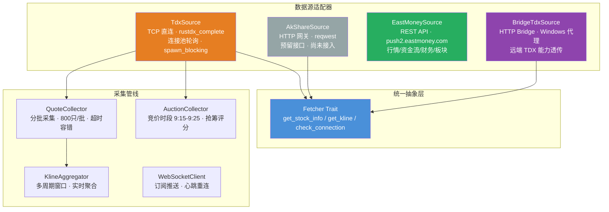
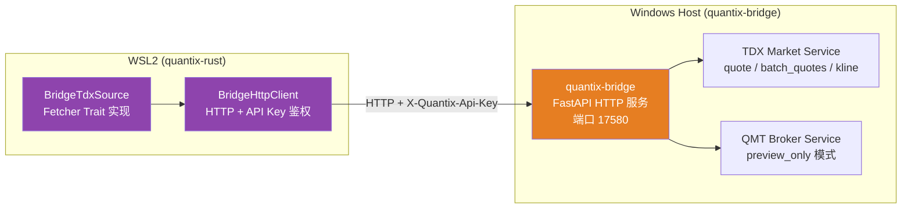
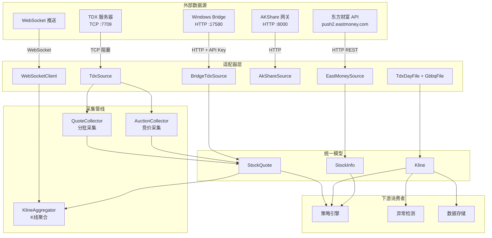

Quantix 的数据采集层由四大异构数据源组成——**TDX 直连**、**AKShare HTTP 网关**、**东方财富 REST API** 和 **Windows Bridge 远端代理**——通过统一的 `Fetcher` trait 抽象实现可插拔切换。本文将深入解析每个适配器的协议机制、连接模型、数据流转路径，以及它们在采集管线（批量行情、K 线聚合、竞价采集、实时推送）中的协作方式。

Sources: [mod.rs](src/sources/mod.rs#L1-L30), [fetcher.rs](src/data/fetcher.rs#L1-L26), [models.rs](src/data/models.rs#L1-L112)

## 统一抽象层：Fetcher Trait 与核心数据模型

所有数据源适配器的契约由 `Fetcher` trait 定义，它声明了三个异步方法：获取股票信息、获取 K 线数据、检查连接状态。这个设计遵循了**接口隔离原则**——每个数据源只需实现自己真正支持的操作，不支持的方法返回 `QuantixError::Unsupported` 而非 panic。

```rust
#[async_trait]
pub trait Fetcher: Send + Sync {
    async fn get_stock_info(&self, code: &str) -> Result<Option<StockInfo>>;
    async fn get_kline(&self, code: &str, start: NaiveDate, end: NaiveDate) -> Result<Vec<Kline>>;
    async fn check_connection(&self) -> Result<()>;
}
```

核心数据模型围绕四个结构展开：**`Kline`**（K 线，含复权类型字段 `AdjustType`）、**`StockInfo`**（股票基本信息，含市场枚举 `SH/SZ/BJ`）、**`Tick`**（逐笔数据）、**`GbbqEvent`**（股本变迁事件，覆盖除权除息、送配股、增发等 14 种类别）。这些模型使用 `rust_decimal::Decimal` 保证金融精度，`NaiveDate` 标定时间维度，与下游存储层和策略引擎共享同一类型定义。

Sources: [fetcher.rs](src/data/fetcher.rs#L1-L26), [models.rs](src/data/models.rs#L1-L112), [error.rs](src/core/error.rs#L1-L58)

## 四大数据源适配器总览



下表从协议、连接模型、实现成熟度、主要用途四个维度对四个适配器进行横向对比：

| 适配器 | 通信协议 | 连接模型 | 实现状态 | 主要用途 |
|--------|---------|---------|---------|---------|
| **TdxSource** | TCP（端口 7709） | 连接池轮询（3-5 个） | ✅ 生产可用 | 批量实时行情采集、竞价数据 |
| **AkShareSource** | HTTP（REST） | 无状态 reqwest Client | ⏳ 预留桩 | 历史数据补充（Python 网关） |
| **EastMoneySource** | HTTP（REST） | 无状态 reqwest Client | ✅ 可用 | 股票列表、资金流向、财务数据 |
| **BridgeTdxSource** | HTTP（REST + API Key） | 无状态 BridgeHttpClient | ✅ 生产可用 | WSL2 环境下远程访问 Windows TDX |

Sources: [tdx.rs](src/sources/tdx.rs#L92-L150), [akshare.rs](src/sources/akshare.rs#L10-L23), [eastmoney.rs](src/sources/eastmoney.rs#L14-L36), [bridge_tdx.rs](src/sources/bridge_tdx.rs#L11-L58)

## TDX 直连适配器（TdxSource）

**TdxSource** 是整个数据采集层的核心引擎，通过 `rustdx_complete` 库直接与通达信标准 TCP 服务器通信（默认端口 7709）。它的架构设计针对两个关键约束做了优化：通达信协议的**阻塞 I/O 特性**，以及高并发场景下的**连接资源竞争**。

### 连接池与轮询机制

构造函数 `TdxSource::new(pool_size, hosts, port, timeout)` 创建一组 `Tcp` 连接，每个连接包装在 `Arc<std::sync::Mutex<Tcp>>` 中形成连接池。轮询选择通过 `AtomicUsize` 索引实现无锁递增：

```rust
fn get_connection(&self) -> Arc<std::sync::Mutex<Tcp>> {
    let index = self.connection_index
        .fetch_add(1, Ordering::Relaxed)
        .wrapping_rem(self.tcp_pool.len());
    self.tcp_pool[index].clone()
}
```

默认配置创建 3 个 TCP 连接，超时 10 秒。初始化时允许部分连接创建失败，但至少需要 1 个成功连接才能正常运行。

### 批量行情采集与异步桥接

`fetch_quotes_batch` 方法是 TDX 的核心能力——接收 `[(u16, &str)]` 格式的股票代码列表，通过 `tokio::task::spawn_blocking` 将阻塞式 TDX 协议操作桥接到 Tokio 异步运行时，避免阻塞事件循环。采集结果经过 `SecurityQuotes::recv_parsed` 解析后转换为 `StockQuote` 结构，自动计算涨跌幅并推断市场标识（6 开头 = 上海，其余 = 深圳）。

整个操作通过 `tokio::time::timeout` 包裹，确保单批采集不会无限挂起。典型的 `StockQuote` 包含 12 个字段：时间戳、代码、名称、OHLC、成交量、成交额、涨跌幅、市场标识。

Sources: [tdx.rs](src/sources/tdx.rs#L92-L285)

## TDX 本地文件解析器（TdxFile）

与 TCP 直连并行存在的另一个 TDX 数据通道是**本地二进制文件解析**。通达信客户端在本地缓存了 `day`（日线）和 `gbbq`（股本变迁）两种二进制文件，TdxFile 模块直接解析这些文件以获取历史数据。

### Day 文件解析（32 字节记录）

每条日线记录固定 32 字节，字段布局为：日期(u32)、开盘价(u32/100)、最高价(u32/100)、最低价(u32/100)、收盘价(u32/100)、成交额(f32)、成交量(u32)、保留字段。`TdxDayRecord::from_bytes` 使用 little-endian 解析，`TdxDayFile::from_file` 按 32 字节步长切片读取全部记录。

### GBBQ 文件解析（29 字节记录）

股本变迁记录每条 29 字节，包含市场标识、6 字节股票代码、日期、事件类别（1-14）、分红/配股/送转股等字段。`TdxGbbqFile` 提供 `filter_a_stock_dividend` 方法过滤 A 股除权除息记录（`category == 1`，代码首字符为 `6/0/3`），`group_by_code` 按股票代码分组以便后续复权计算。

### 复权计算引擎（FuquanCalculator）

**FuquanCalculator** 实现基于涨跌幅连续性的复权因子算法：`factor = factor * (close / preclose)`，除权日通过 `compute_pre_pct` 调整前收盘价。支持前复权（`apply_qfq`，使用 `latest_factor / factor` 比值调整）和后复权（`apply_hfq`，直接乘以 factor）两种模式。计算结果产出 `TdxDayData` 结构，包含复权因子、前收盘价、涨跌幅等衍生字段。

Sources: [tdx_file.rs](src/sources/tdx_file.rs#L1-L331), [fuquan.rs](src/sources/tdx_file/fuquan.rs#L1-L200)

## AKShare 适配器（AkShareSource）

**AkShareSource** 定位为通过外部 Python HTTP 服务获取数据的网关适配器。构造时接收 `base_url`，内部使用 `reqwest::Client` 发起 HTTP 请求。当前实现为**预留桩**——`get_stock_info` 和 `get_kline` 均返回 `QuantixError::Unsupported`，仅 `check_connection` 通过访问 `{base_url}/health` 端点验证服务可达性。

这个设计的意图是保留与 [AKShare](https://github.com/akfamily/akshare) Python 生态的集成路径——用户可以在本地或远程部署一个 AKShare HTTP 包装服务，Quantix 通过此适配器访问其丰富的数据接口（涵盖股票、期货、基金、宏观经济等领域）。当需要扩展此适配器时，只需在对应方法中实现真实的 HTTP 调用与 JSON 解析逻辑。

配置位于 `config/default.toml` 的 `[data_sources.akshare]` 节，包含 `base_url` 和 `rate_limit` 两个参数。

Sources: [akshare.rs](src/sources/akshare.rs#L1-L81), [default.toml](config/default.toml#L24-L26)

## 东方财富适配器（EastMoneySource）

**EastMoneySource** 通过 HTTP REST API 访问东方财富 `push2.eastmoney.com` 数据服务，覆盖四个数据维度：股票列表、实时行情、资金流向、财务数据。它不实现 `Fetcher` trait，而是以独立方法的形式提供更丰富的领域专用接口。

### 数据能力矩阵

| 方法 | API 端点 | 返回类型 | 说明 |
|------|---------|---------|------|
| `get_stock_list` | `/api/qt/clist/getlist` | `Vec<StockInfo>` | 全市场股票列表，支持板块筛选（沪深300/中证500等） |
| `get_realtime_quotes` | `/api/qt/ulist.np/get` | `HashMap<String, Quote>` | 批量实时行情，返回 OHLCV + 涨跌幅 |
| `get_money_flow` | `/api/qt/stock/fflow/get` | `MoneyFlowData` | 主力/散户资金流向 |
| `get_financial_data` | 预留 | `FinancialData` | 财报数据（利润表/资产负债表/现金流量表） |

请求中通过 `fs` 参数编码市场筛选条件：`m:0+t:6`（深圳 A 股）、`m:0+t:80`（创业板）、`m:1+t:2`（上海 A 股）、`m:1+t:23`（科创板）。代码到 `secid` 的映射遵循规则：6 开头编码为 `1.{code}`（上海），其余编码为 `0.{code}`（深圳/北京）。

### 领域模型层

EastMoneySource 定义了专属的数据模型：**`Quote`**（10 字段实时行情）、**`MoneyFlowData`**（主力/散户净流入流出）、**`FinancialData`**（7 字段财报摘要）、**`Board`**（5 种板块枚举：HS300/ZZ500/SZ50/KCB50/BZ50）。这些模型与核心 `data::models` 层的 `StockInfo`/`Kline` 有别，服务于不同的业务场景。

Sources: [eastmoney.rs](src/sources/eastmoney.rs#L1-L320)

### 异常检测模块中的东方财富集成

在 `anomaly` 模块中，**`EastMoneyAnomalySource`** 是东方财富 API 的另一个独立实现，专用于异常检测场景。它实现了 `anomaly::detector::DataSource` trait（不同于 `data::fetcher::Fetcher`），提供 `get_stock_list` 和 `get_klines` 两个方法。K 线请求支持分钟级周期（1/5/15/30/60min）和日线/周线/月线，通过 `klt` 参数映射，`fqt` 参数控制复权模式（0=不复权/1=前复权/2=后复权）。

Sources: [eastmoney_source.rs](src/anomaly/eastmoney_source.rs#L1-L200)

## Bridge 远端 TDX 适配器（BridgeTdxSource）

**BridgeTdxSource** 是 Quantix 跨平台架构的关键组件，它使 WSL2 环境中的 Rust 程序能够通过 HTTP 协议访问 Windows 主机上运行的 `quantix-bridge` Python 服务，间接获取 TDX 行情和 K 线数据。这是项目在 "WSL2 开发 + Windows Bridge" 架构下的主要数据通路。

### Bridge 架构拓扑



### BridgeHttpClient 通信协议

`BridgeHttpClient` 封装了与 Windows Bridge 服务的全部 HTTP 交互，核心参数通过环境变量注入：

| 环境变量 | 默认值 | 说明 |
|---------|-------|------|
| `QUANTIX_BRIDGE_BASE_URL` | `http://127.0.0.1:17580` | Bridge 服务地址 |
| `QUANTIX_BRIDGE_API_KEY` | 无（可选） | API Key 鉴权令牌 |

所有请求通过 `X-Quantix-Api-Key` HTTP 头传递认证信息。`capabilities` 端点返回 Bridge 服务的启用状态和支持能力（TDX 的 quote/batch_quotes/kline，QMT 的 account_status/order_preview）。

### 符号格式转换

Bridge 协议使用 `{code}.{market}` 格式（如 `000001.SZ`、`600036.SH`），而 Quantix 内部使用纯数字代码 + 数字市场标识。`BridgeTdxSource` 内嵌了双向转换函数：

- **`format_symbol(market, code)`**：`(1, "600036")` → `"600036.SH"`，其他 → `"{code}.SZ"`
- **`infer_symbol(code)`**：6 开头 → `"{code}.SH"`，其他 → `"{code}.SZ"`
- **`split_symbol(symbol)`**：`"000001.SZ"` → `("000001", 0)`，`"600036.SH"` → `("600036", 1)`

### K 线数据的 Bridge 通路

`BridgeTdxSource::get_kline` 通过 `GET /api/v1/data/tdx/kline/{symbol}` 端点请求 K 线，参数为 `period`（固定 "1d"）、`start`、`end`。返回的 `BridgeKlineBarPayload` 经日期解析（`%Y-%m-%d`）和 `f64 → Decimal` 精度转换后映射为内部 `Kline` 结构，`adjust_type` 默认为 `None`（不复权）。

Sources: [bridge_tdx.rs](src/sources/bridge_tdx.rs#L1-L142), [client.rs](src/bridge/client.rs#L1-L206), [models.rs](src/bridge/models.rs#L1-L167), [error.rs](src/bridge/error.rs#L1-L13), [runtime.rs](src/core/runtime.rs#L18-L19), [runtime.rs](src/core/runtime.rs#L84-L121)

## 采集管线组件

四个适配器之上，Quantix 构建了四条专用采集管线，将底层协议细节封装为面向业务场景的高层服务。

### QuoteCollector：批量行情采集器

**QuoteCollector** 封装了全市场行情的分批采集逻辑。核心参数：`batch_size`（默认 800 只/批）和 `collect_timeout`（默认 10 秒/批）。`collect_all` 方法将股票列表分块后逐批调用 `TdxSource::fetch_quotes_batch`，每批间插入 100ms 延迟以避免触发服务器限流，单批失败不中断整体流程。

Sources: [quote_collector.rs](src/sources/quote_collector.rs#L1-L200)

### AuctionCollector：竞价数据采集器

**AuctionCollector** 专注 9:15-9:25 集合竞价时段的数据采集。它直接持有 `Tcp` 连接（非连接池），通过交易日历（`TradingCalendar`）判断当前是否为交易日。采集结果 `AuctionQuote` 包含封单金额（`sealed_amount_buy/sell`）和**抢筹强度评分**（0-100 分，由涨幅权重 40%、买盘占比 30%、成交量 30% 加权计算）。`run` 方法在竞价时段内以 1 秒间隔循环采集。

Sources: [auction_collector.rs](src/sources/auction_collector.rs#L1-L324)

### KlineAggregator：实时 K 线聚合器

**KlineAggregator** 从实时 `StockQuote` Tick 数据中流式聚合成多周期 K 线。支持 6 种周期（1m/5m/15m/30m/60m/1d），每种周期通过独立的 `KlineWindow` 维护 OHLCV 状态。窗口时间对齐策略因周期而异——分钟级窗口对齐到对应的分钟边界，日线窗口对齐到 9:30 开盘时间。后台每 5 分钟清理超过 2 小时未更新的过期窗口。完成窗口通过 `mpsc::UnboundedSender<KlineData>` 向下游消费者推送。

Sources: [kline_aggregator.rs](src/sources/kline_aggregator.rs#L1-L426)

### WebSocketClient：实时行情推送

**WebSocketClient** 提供基于 WebSocket 的实时行情订阅能力，默认连接东方财富推送端点。生命周期管理通过 `ConnectionState` 枚举（Disconnected/Connecting/Connected/Reconnecting）追踪。核心机制：30 秒心跳间隔、5 秒重连间隔、最多 10 次重连尝试、1000 条消息缓冲。订阅管理使用 `Arc<RwLock<HashMap<String, Subscription>>>` 存储订阅状态，消息通过 `mpsc::UnboundedSender<RealtimeQuote>` 回调传递。

Sources: [websocket.rs](src/sources/websocket.rs#L1-L382)

## 数据流转全景图



## 配置与运行时加载

数据源配置通过 TOML 文件和环境变量两级加载。TDX 和 AKShare 的配置定义在 `config/default.toml` 的 `[data_sources]` 节，Bridge 的配置通过环境变量 `QUANTIX_BRIDGE_BASE_URL` 和 `QUANTIX_BRIDGE_API_KEY` 注入。运行时通过 `AppConfig::load` 或 `CliRuntime::load` 统一加载：

| 配置项 | 文件/环境 | 默认值 | 影响范围 |
|-------|---------|-------|---------|
| `data_sources.tdx.hosts` | `config/default.toml` | `["114.80.63.12", "114.80.63.13"]` | TdxSource 连接目标 |
| `data_sources.tdx.port` | `config/default.toml` | `7709` | TDX 端口 |
| `data_sources.tdx.timeout` | `config/default.toml` | `5000` | TDX 超时(ms) |
| `data_sources.akshare.base_url` | `config/default.toml` | `http://localhost:8000` | AKShare 服务地址 |
| `QUANTIX_BRIDGE_BASE_URL` | 环境变量 | `http://127.0.0.1:17580` | Bridge 服务地址 |
| `QUANTIX_BRIDGE_API_KEY` | 环境变量 | 无 | Bridge 鉴权密钥 |

`BridgeRuntimeSettings::from_env` 在加载时将 Bridge 配置注入 `CliRuntime.bridge` 字段，包含 `base_url`、`api_key`、`tdx_enabled`、`qmt_preview_enabled` 四个属性。

Sources: [default.toml](config/default.toml#L19-L26), [config.rs](src/core/config.rs#L51-L68), [runtime.rs](src/core/runtime.rs#L84-L121)

## 错误处理模型

数据源层的错误统一通过 `QuantixError` 枚举传递，关键变体包括：

- **`DataSource(String)`**：TDX 连接失败、Bridge 通信错误、东方财富 API 异常
- **`DataParse(String)`**：Bridge K 线日期解析失败、f64 → Decimal 精度转换错误
- **`Http(reqwest::Error)`**：HTTP 请求层面的网络错误
- **`Timeout(String)`**：TDX 批量采集超时、WebSocket 心跳超时
- **`Unsupported(String)`**：适配器未实现的 Fetcher 方法

Bridge 模块有独立的 `BridgeError` 枚举（`Config` / `Http`），通过 `map_bridge_err` 函数转换为 `QuantixError::DataSource`。这种分层错误模型确保了底层协议细节不会泄漏到上层业务逻辑。

Sources: [error.rs](src/core/error.rs#L1-L58), [bridge_tdx.rs](src/sources/bridge_tdx.rs#L111-L118), [bridge/error.rs](src/bridge/error.rs#L1-L13)

## 继续阅读

- **数据持久化层**：[多数据库集成（ClickHouse/PostgreSQL/TDengine）](9-duo-shu-ju-ku-ji-cheng-clickhouse-postgresql-tdengine)——了解采集到的数据如何写入多种数据库
- **实时数据管线**：[K线聚合、WebSocket 实时行情与竞价采集](10-kxian-ju-he-websocket-shi-shi-xing-qing-yu-jing-jie-cai-ji)——深入了解 KlineAggregator 和 WebSocket 的完整实现
- **下游消费**：[技术指标管线与注册表机制](15-ji-zhu-zhi-biao-guan-xian-yu-zhu-ce-biao-ji-zhi)——数据如何进入技术分析计算管线
- **Bridge 完整方案**：[WSL2 Windows Bridge 架构](docs/architecture/WSL2_WINDOWS_BRIDGE_ARCHITECTURE.md)——Bridge 跨平台架构的详细设计文档