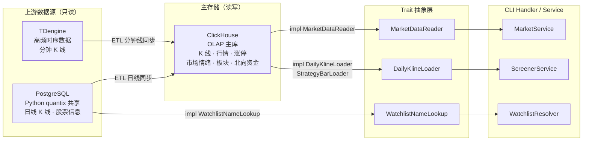
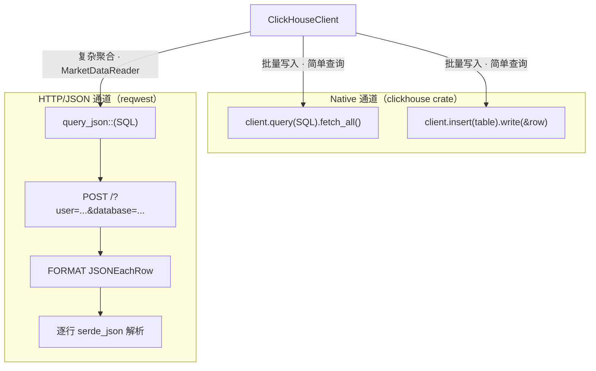
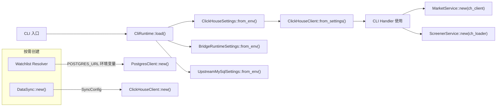

Quantix-Rust 采用**多数据库协同架构**，针对不同数据类型和访问模式选择最优的存储引擎：ClickHouse 作为主 OLAP 存储承载 K 线、行情、市场情绪等海量分析数据；PostgreSQL 与上游 Python quantix 项目共享历史日线数据；TDengine 专为高频分钟级时序数据提供 REST API 读取能力。三者通过 ETL 同步管线和统一的 Trait 抽象层协作，在保持各数据库特有优势的同时实现透明的跨库数据访问。

Sources: [mod.rs](src/db/mod.rs#L1-L15), [config.rs](src/core/config.rs#L1-L97), [docker-compose.yml](docker-compose.yml#L1-L88)

## 架构全景与数据库分工

在深入每个数据库的实现细节之前，需要先理解三者之间的角色分工与数据流向。ClickHouse 作为 Rust 项目自身管理的**主数据库**，承担写入和查询双重职责；PostgreSQL 和 TDengine 则是从上游 Python 项目的**只读数据源**，通过 ETL 管线将数据汇入 ClickHouse 统一分析。



### 三数据库职责对比

| 维度 | ClickHouse | PostgreSQL | TDengine |
|---|---|---|---|
| **角色** | 主存储（读写） | 上游共享库（只读） | 高频时序源（只读） |
| **数据类型** | K 线、行情、涨停、市场情绪、板块排名、北向资金、除权除息 | 日线 K 线、股票基本信息 | 分钟级 K 线 |
| **连接方式** | Native HTTP + RowBinary 协议 | sqlx 连接池（max 10） | REST API（reqwest） |
| **Rust 依赖** | `clickhouse = "0.12"` | `sqlx = "0.7"` (postgres) | `reqwest` (HTTP) |
| **Feature Flag** | 默认启用 | `postgresql` | `tdengine-rest` |
| **配置方式** | 环境变量（`CLICKHOUSE_*`） | `POSTGRES_URL` 环境变量 | `config/default.toml` |
| **Docker 容器** | `docker-compose.yml` 内置 | `docker-compose.yml` 内置 | 外部部署 |

Sources: [clickhouse/mod.rs](src/db/clickhouse/mod.rs#L24-L36), [postgresql.rs](src/db/postgresql.rs#L37-L52), [tdengine.rs](src/db/tdengine.rs#L46-L64), [Cargo.toml](Cargo.toml), [docker-compose.yml](docker-compose.yml#L40-L88)

## ClickHouse：主 OLAP 存储引擎

ClickHouse 是整个系统的**核心存储引擎**，采用列式存储和 MergeTree 引擎族，针对海量金融时序数据的批量写入和聚合查询进行了深度优化。客户端实现位于 `src/db/clickhouse/` 目录，按职责拆分为五个模块。

### 模块结构

```
src/db/clickhouse/
├── mod.rs       ← ClickHouseClient 客户端定义、双通道查询
├── models.rs    ← 数据模型（8 个 Row 结构体）+ 类型转换
├── schema.rs    ← DDL 建表语句（7 张表）
├── kline.rs     ← K 线数据的 CRUD 操作
├── gbbq.rs      ← 除权除息事件的 CRUD 操作
└── tests.rs     ← 单元测试
```

Sources: [clickhouse/mod.rs](src/db/clickhouse/mod.rs#L1-L195)

### 双通道查询架构

`ClickHouseClient` 维护两套查询通道，解决不同场景下的协议兼容性问题。**Native 通道**基于 `clickhouse` crate 的 RowBinary 协议，适合批量写入和简单查询；**HTTP/JSON 通道**通过 `reqwest` 直接发送 SQL 并解析 `JSONEachRow` 格式响应，绕过 RowBinary 编解码限制，用于复杂聚合查询。



`query_json` 方法的实现核心是：将 SQL 拼接 `FORMAT JSONEachRow` 后通过 HTTP POST 发送，然后逐行用 `serde_json` 反序列化为泛型 `T`。这种方式在处理 `Nullable` 字段和嵌套聚合结果时比 RowBinary 更可靠。批量写入则使用 `async_insert=1` 和 `wait_for_async_insert=1` 选项，通过 chunk 分片控制每批大小（默认 1000 条）。

Sources: [clickhouse/mod.rs](src/db/clickhouse/mod.rs#L101-L150), [clickhouse/mod.rs](src/db/clickhouse/mod.rs#L170-L194)

### 数据模型与表结构

系统定义了 **8 个 ClickHouse Row 模型**，每个模型通过 `#[derive(clickhouse::Row)]` 标注，同时实现 `Serialize`/`Deserialize` 以支持双通道协议。下表汇总了所有模型与对应的数据库表：

| 模型结构体 | 对应表 | 引擎 | 分区策略 | 排序键 | 用途 |
|---|---|---|---|---|---|
| `StockInfoCH` | `stock_info` | ReplacingMergeTree | — | `(market, code)` | 股票基本信息 |
| `StockQuoteCH` | `stock_realtime_quotes` | MergeTree | `toYYYYMM(timestamp)` | `(date, code, timestamp)` | 实时行情快照 |
| `KlineDataCH` | `kline_data` | MergeTree | `(period, toYYYYMM(timestamp))` | `(date, code, period, timestamp)` | 多周期 K 线 |
| `LimitUpEventCH` | `limit_up_events` | MergeTree | `toYYYYMM(limit_time)` | `(date, limit_time, code)` | 涨停板事件 |
| `GbbqEventCH` | `gbbq_events` | ReplacingMergeTree | `toYYYYMM(event_date)` | `(event_date, code, category)` | 除权除息事件 |
| `SectorDailyCH` | `sector_daily` | ReplacingMergeTree | `toYYYYMM(trade_date)` | `(trade_date, sector_type, rank, sector_code)` | 板块日线排名 |
| `NorthFlowDailyCH` | `north_flow_daily` | ReplacingMergeTree | `toYYYYMM(trade_date)` | `(trade_date)` | 北向资金日线 |
| `MarketSentimentDailyCH` | `market_sentiment_daily` | ReplacingMergeTree | `toYYYYMM(trade_date)` | `(trade_date)` | 市场情绪日线 |

**ReplacingMergeTree** 用于需要幂等更新的表（如股票信息、板块排名），通过版本列（`updated_at`）去重；**MergeTree** 用于追加写入的时序数据（如行情、K 线）。所有表均通过 `MATERIALIZED toDate(...)` 列生成日期物化列，加速按日查询。

Sources: [clickhouse/models.rs](src/db/clickhouse/models.rs#L1-L267), [clickhouse/schema.rs](src/db/clickhouse/schema.rs#L1-L219)

### K 线操作与批量写入

K 线模块（`kline.rs`）提供了完整的 CRUD 操作：`get_kline_data` 支持按股票代码、周期、日期范围和数量限制查询；`insert_kline_data_batch` 实现了分片批量写入，每批大小由 `batch_size` 字段控制（默认 1000）。此外还包含 `get_daily_from_minute` 聚合查询，利用 ClickHouse 的 `toStartOfDay`、`argMin`、`argMax` 等函数将分钟线聚合为日线。实时行情的批量写入 `insert_stock_quotes_batch` 同样遵循分片模式。

Sources: [clickhouse/kline.rs](src/db/clickhouse/kline.rs#L1-L245)

### 除权除息事件操作

GBBQ 模块（`gbbq.rs`）处理股本变迁事件，支持单条插入（`insert_gbbq_event`）、批量插入（`insert_gbbq_events`）、按代码和日期范围查询（`get_gbbq_events`）以及获取最新除权事件（`get_latest_gbbq_event`）。批量写入模式与 K 线一致，使用 `async_insert` 选项优化吞吐量。

Sources: [clickhouse/gbbq.rs](src/db/clickhouse/gbbq.rs#L1-L181)

### Schema 自动初始化

`schema.rs` 模块实现了 `init_database` 方法，在应用启动时自动创建数据库和全部 7 张表。建表 SQL 使用 `ON CLUSTER '{cluster}'` 语法支持集群部署，在单节点模式下通过字符串替换为 `single_cluster` 降级。市场相关表（`sector_daily`、`north_flow_daily`、`market_sentiment_daily`）的 DDL 集中在 `models.rs` 的 `market_table_sqls()` 函数中管理，通过 `create_market_tables` 统一执行。

Sources: [clickhouse/schema.rs](src/db/clickhouse/schema.rs#L8-L218), [clickhouse/models.rs](src/db/clickhouse/models.rs#L197-L255)

## PostgreSQL：上游共享数据库

PostgreSQL 客户端的设计原则是**只读访问**——它连接到上游 Python quantix 项目已有的 PostgreSQL 实例，读取历史日线数据和股票基本信息，为 Rust 项目提供数据兼容性和迁移过渡支持。

### 连接池与查询模式

`PostgresClient` 使用 `sqlx` 的 `PgPoolOptions` 创建连接池（最大 10 连接），所有查询通过参数化绑定（`$1`, `$2`...）防止 SQL 注入。核心查询方法包括：

- **`query_kline_daily`**：按代码和日期范围查询日线数据，使用 `$2::date IS NULL` 模式实现可选参数
- **`query_stock_info`**：查询单只股票基本信息
- **`list_stocks`**：按市场筛选列出所有股票，使用同样的 `IS NULL` 可选参数模式

数据模型 `KlineDaily` 和 `StockInfo` 通过 `#[derive(FromRow)]` 自动映射查询结果，字段类型使用 `Decimal`（`rust_decimal`）确保金融数据的精度安全。

Sources: [postgresql.rs](src/db/postgresql.rs#L1-L131)

### 在 Watchlist 中的集成应用

PostgreSQL 在 Watchlist 模块中扮演股票名称解析的角色。`PostgresWatchlistNameLookup` 实现了 `WatchlistNameLookup` trait，通过 `POSTGRES_URL` 环境变量按需创建连接，将股票代码映射为可读名称。这种**按需连接**的设计避免了在不需要 PostgreSQL 的场景下引入连接开销。

Sources: [watchlist/resolver.rs](src/watchlist/resolver.rs#L110-L126)

## TDengine：高频时序数据源

TDengine 客户端采用 **REST API** 方式连接，通过 `reqwest` 发送 HTTP 请求执行 SQL 查询。这种无原生驱动依赖的设计使得部署更轻量，无需安装 TDengine 客户端库。客户端核心接口是 `query_minute_kline`，支持按表名、股票代码、时间戳范围和数量限制查询分钟 K 线，返回 `MinuteKline` 结构体列表。时间戳解析兼容秒级和毫秒级两种精度。`check_connection` 通过 REST 登录接口验证连通性。

Sources: [tdengine.rs](src/db/tdengine.rs#L1-L134)

## ETL 同步管线

ETL 模块（`src/sync/etl.rs`）实现了跨数据库的数据同步，核心数据流向为 **PostgreSQL/TDengine → ClickHouse**。`DataSync` 结构体持有 ClickHouse 客户端和同步配置，提供两个主要同步方法：

- **`sync_daily_klines`**：从 PostgreSQL 读取日线数据写入 ClickHouse
- **`sync_minute_klines`**：从 TDengine 读取分钟线写入 ClickHouse

同步配置 `SyncConfig` 支持自定义 PostgreSQL URL、ClickHouse 连接参数、批量大小（默认 1000）和同步间隔（默认 300 秒）。`run_sync_schedule` 方法实现了一个定时循环，每隔固定间隔同步最近 30 天的日线数据。同步结果通过 `SyncStats` 结构体统计记录数和耗时。

Sources: [sync/etl.rs](src/sync/etl.rs#L1-L262)

## Trait 抽象层与数据库解耦

系统通过多个 `async_trait` 定义了数据库无关的数据访问接口，使上层业务逻辑与具体数据库实现完全解耦。这是整个多数据库架构的**核心设计模式**。

### 核心抽象接口

| Trait | 定义位置 | 方法 | 实现者 |
|---|---|---|---|
| `MarketDataReader` | `market/service.rs` | `load_board_rankings`, `load_north_flow`, `load_market_sentiment`, `load_leaders` | `ClickHouseClient` |
| `DailyKlineLoader` | `screener/service.rs` | `load_daily_klines` | `ClickHouseDailyKlineLoader`, `NullDailyKlineLoader` |
| `StrategyBarLoader` | `strategy/runtime.rs` | `load_daily_bars` | `ClickHouseDailyKlineLoader` |
| `WatchlistNameLookup` | `watchlist/resolver.rs` | `lookup_name` | `PostgresWatchlistNameLookup` |
| `WatchlistQuoteLookup` | `watchlist/resolver.rs` | `lookup_quotes` | `TdxWatchlistQuoteLookup`, `BridgeTdxWatchlistQuoteLookup` |
| `Storage` | `data/storage.rs` | `save_klines`, `query_klines` | （接口定义，待实现） |
| `Fetcher` | `data/fetcher.rs` | `get_stock_info`, `get_kline`, `check_connection` | （接口定义，待实现） |

以 `MarketDataReader` 为例，`MarketService` 通过泛型参数 `R: MarketDataReader` 接收数据读取器，在 CLI 层通过 `create_clickhouse_client()` 构造 `ClickHouseClient` 并传入。这种模式使得未来可以轻松替换数据源（如添加缓存层或切换数据库），而不影响业务逻辑。

Sources: [market/service.rs](src/market/service.rs#L20-L124), [screener/service.rs](src/screener/service.rs#L14-L27), [watchlist/resolver.rs](src/watchlist/resolver.rs#L30-L46), [data/storage.rs](src/data/storage.rs#L7-L19), [data/fetcher.rs](src/data/fetcher.rs#L10-L25)

## 配置管理与连接创建

### 环境变量配置

ClickHouse 通过 `CliRuntime` 统一管理配置，在 `ClickHouseSettings::from_env()` 中读取四个环境变量：

| 环境变量 | 默认值 | 说明 |
|---|---|---|
| `CLICKHOUSE_URL` | `http://localhost:8123` | HTTP 接口地址 |
| `CLICKHOUSE_DB` | `quantix` | 数据库名称 |
| `CLICKHOUSE_USER` | `default` | 用户名 |
| `CLICKHOUSE_PASSWORD` | _(空)_ | 密码 |

PostgreSQL 和 TDengine 的配置通过 `config/default.toml` 定义结构化参数，同时支持环境变量覆盖。所有配置在 `CliRuntime::load()` 时统一初始化，自动加载 `.env` 文件。

Sources: [core/config.rs](src/core/config.rs#L8-L24), [core/runtime.rs](src/core/runtime.rs#L21-L109), [config/default.toml](config/default.toml#L1-L27), [.env.example](.env.example#L1-L16)

### 客户端创建流程



所有 CLI Handler 通过共享的 `create_clickhouse_client()` 函数创建 ClickHouse 客户端，该函数内部调用 `CliRuntime::load()` 加载配置后通过 `ClickHouseClient::from_settings()` 构造实例。PostgreSQL 和 TDengine 客户端则按需在特定模块中创建。

Sources: [cli/handlers/mod.rs](src/cli/handlers/mod.rs#L245-L248), [core/runtime.rs](src/core/runtime.rs#L92-L109)

## 统一错误处理

三个数据库客户端的错误均映射到 `QuantixError` 枚举的两个变体：`DatabaseConnection`（连接失败）和 `DatabaseQuery`（查询失败）。ClickHouse 的 `query_json` 方法额外使用 `DataParse` 变体处理 JSON 解析错误。`sqlx::Error` 和 `reqwest::Error` 通过 `#[from]` 自动转换，确保错误链路完整。

Sources: [core/error.rs](src/core/error.rs#L1-L58)

## Docker 容器化部署

`docker-compose.yml` 内置了 PostgreSQL 和 ClickHouse 的容器定义，应用容器通过 `depends_on` + `service_healthy` 确保数据库就绪后启动。初始化 SQL 脚本通过卷挂载自动执行。生产环境配置（`docker-compose.prod.yml`）为 ClickHouse 分配 4 核 8G、PostgreSQL 分配 2 核 4G 的资源限制，并强制要求通过环境变量设置密码。

Sources: [docker-compose.yml](docker-compose.yml#L1-L88), [docker-compose.prod.yml](docker-compose.prod.yml#L53-L112), [scripts/init-clickhouse.sql](scripts/init-clickhouse.sql#L1-L94), [scripts/init-postgres.sql](scripts/init-postgres.sql#L1-L41)

## Feature Flag 编译控制

Cargo.toml 定义了四个数据库相关的 Feature Flag：

| Feature | 默认启用 | 说明 |
|---|---|---|
| `postgresql` | ✅ | 启用 sqlx postgres 驱动 |
| `tdengine-rest` | ✅ | 启用 TDengine REST 客户端（无额外依赖） |
| `tdengine-ws` | ❌ | 启用 TDengine WebSocket 客户端（依赖 `taos-ws`） |
| `sqlite` | ❌ | 启用 sqlx sqlite 驱动 |

默认编译包含 ClickHouse + PostgreSQL + TDengine REST，可通过 `--no-default-features --features postgresql` 等方式按需裁剪。

Sources: [Cargo.toml](Cargo.toml)

## 延伸阅读

- 了解数据如何从外部数据源流入数据库：[多数据源适配器架构（TDX/AKShare/东方财富/Bridge）](8-duo-shu-ju-yuan-gua-pei-qi-jia-gou-tdx-akshare-dong-fang-cai-fu-bridge)
- 了解 ClickHouse 市场数据如何在业务层使用：[配置管理与多环境加载机制](5-pei-zhi-guan-li-yu-duo-huan-jing-jia-zai-ji-zhi)
- 了解 Docker 部署完整方案：[Docker 容器化部署与生产环境配置](26-docker-rong-qi-hua-bu-shu-yu-sheng-chan-huan-jing-pei-zhi)